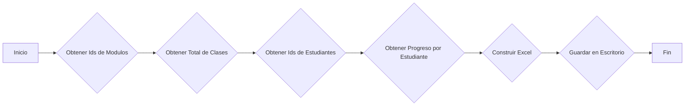

## 📄 Descripción general del proyecto

-   **Nombre del código:** Student Progress Tracker
-   **Versión:** 1.0
-   **Explicación general:** Este código extrae el progreso de los estudiantes de una plataforma de aprendizaje en línea y genera un archivo Excel con el email del estudiante y su porcentaje de progreso.
-   **Qué problema resuelve el código:** Facilita el seguimiento del progreso individual de los estudiantes, consolidando la información en un formato accesible y fácil de analizar.

## ⚙️ Visión general del sistema



-   **Tecnologías utilizadas:**
    -   Python 3.x
    -   `pandas`
    -   `requests`
    -   `pymysql`
    -   `openpyxl`
    -   `python-dotenv`
-   **Dependencias:**
    -   `pandas`: Para la manipulación y creación de DataFrames.
    -   `requests`: Para realizar solicitudes HTTP a la API.
    -   `pymysql`: Para la conexión y consulta a la base de datos MySQL.
    -   `openpyxl`: Para la escritura de archivos Excel.
    -   `python-dotenv`: Para cargar variables de entorno desde un archivo `.env`.
-   **Requisitos del sistema:**
    -   Python 3.6 o superior.
    -   Acceso a la API de la plataforma de aprendizaje.
    -   Acceso a la base de datos MySQL.
-   **Prerrequisitos:**
    -   Instalar las dependencias mediante `pip install pandas requests pymysql openpyxl python-dotenv`.
    -   Configurar las variables de entorno en un archivo `.env` (ver ejemplo abajo).

    ```
    DB_HOST=your_db_host
    DB_USER=your_db_user
    DB_PASSWORD=your_db_password
    DB_NAME=your_db_name
    GET_MODULES_IDS_URL=your_modules_api_url
    GET_LESSONS_BY_MODULE_URL=your_lessons_api_url
    GET_STUDENTS_IDS_QUERY=your_students_ids_query
    GET_STUDENT_CLASSES_SEEN_QUERY=your_student_classes_seen_query
    GET_STUDENT_CLASSES_SEEN_QUERY_TWO=your_student_classes_seen_query_two
    GET_STUDENT_EMAIL_QUERY=your_student_email_query
    USER_NAME=your_api_user
    PASSWORD=your_api_password
    ```

## 📦 Guía de uso

-   **Cómo usarlo:**

    1.  Configurar las variables de entorno en el archivo `.env`.
    2.  Ejecutar el script `python your_script_name.py`.
    3.  El script generará un archivo Excel llamado `students_progress.xlsx` en el escritorio del usuario.
-   **Explicación de los pasos:**
    1.  **Obtener IDs de módulos:** La función `get_modules_ids()` realiza una solicitud GET a la API para obtener una lista de IDs de módulos.
    2.  **Obtener el total de clases:** La función `get_total_amount_classes()` utiliza los IDs de los módulos para obtener el número total de clases disponibles.
    3.  **Obtener IDs de estudiantes:** La función `get_students_ids()` ejecuta una consulta SQL para obtener una lista de IDs de estudiantes.
    4.  **Obtener el progreso por estudiante:** La función `get_progress_student()` calcula el porcentaje de progreso de cada estudiante basándose en las clases vistas y el total de clases.
    5.  **Construir el archivo Excel:** La función `build_excel()` crea un DataFrame de pandas con los datos de progreso de los estudiantes y lo guarda en un buffer de memoria en formato Excel.
    6.  **Guardar el archivo en el escritorio:** La función `save_to_desktop()` toma el buffer de memoria y guarda el archivo Excel en el escritorio del usuario.
-   **Caso de uso de ejemplo:**

    ```python
    import os
    from dotenv import load_dotenv
    from your_script_name import build_excel, save_to_desktop

    load_dotenv()

    # Ejemplo de uso de las funciones principales
    try:
        save_to_desktop()
        print("Archivo Excel guardado exitosamente en el escritorio.")
    except Exception as e:
        print(f"Ocurrió un error: {e}")
    ```

## 🔐 Documentación de la API

-   **Endpoints:**
    -   `GET_MODULES_IDS_URL`:  Obtiene una lista de IDs de módulos. Requiere autenticación básica.
    -   `GET_LESSONS_BY_MODULE_URL/{module_id}`: Obtiene una lista de lecciones para un módulo específico. Requiere autenticación básica.
-   **Formatos de solicitud y respuesta:**
    -   Las solicitudes a la API utilizan el método GET.
    -   Se espera que las respuestas de la API estén en formato JSON.
-   **Autenticación y autorización:**
    -   Se utiliza autenticación básica HTTP para acceder a los endpoints de la API. Las credenciales (nombre de usuario y contraseña) se obtienen de las variables de entorno `USER_NAME` y `PASSWORD`.

## 📚 Referencias

-   **pandas:** [https://pandas.pydata.org/](https://pandas.pydata.org/)
-   **requests:** [https://requests.readthedocs.io/](https://requests.readthedocs.io/)
-   **pymysql:** [https://pymysql.readthedocs.io/](https://pymysql.readthedocs.io/)
-   **openpyxl:** [https://openpyxl.readthedocs.io/](https://openpyxl.readthedocs.io/)
-   **python-dotenv:** [https://github.com/theskumar/python-dotenv](https://github.com/theskumar/python-dotenv)
-   **HTTP Basic Authentication:** [https://developer.mozilla.org/en-US/docs/Web/HTTP/Authentication](https://developer.mozilla.org/en-US/docs/Web/HTTP/Authentication)
