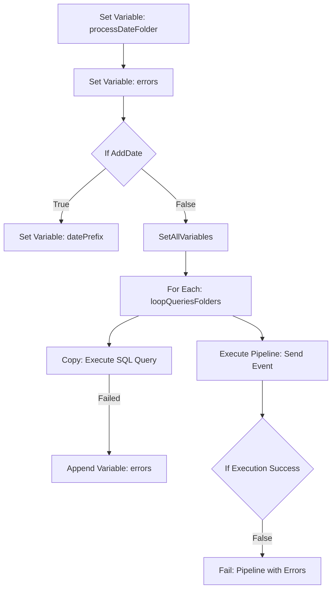

# Documentación de la Pipeline: PL_GLB_IntegrationRuntimeSQL_MSSQL

## Descripción
Esta pipeline ejecuta consultas en una base de datos on-premise y gestiona la extracción y almacenamiento de datos. 

### Flujo General

## Entradas (Inputs)
La pipeline recibe los siguientes parámetros:
- **fileName** (*string*): Nombre del archivo de salida. Por defecto "None".
- **addDate** (*bool*): Si se debe agregar una fecha al nombre del archivo.
- **addDateFormat** (*string*): Formato de la fecha a agregar.
- **event** (*string*): Evento de orquestación.
- **queriesAndFolder** (*array*): Lista de carpetas y consultas SQL a ejecutar.
- **queryTimeout** (*string*): Tiempo máximo de espera para cada consulta.
- **containerDestination** (*string*): Contenedor de destino en Azure.
- **secretName_src** (*string*): Nombre del secreto de autenticación.
- **ingestionSource** (*string*): Fuente de datos de ingesta.
- **processDate** (*string*): Fecha de procesamiento.
- **container** (*string*): Contenedor donde se almacenarán los datos.

## Salidas (Outputs)
La pipeline genera los siguientes outputs:
- **Archivos CSV**: Los resultados de las consultas SQL se guardan en archivos CSV dentro del contenedor especificado.
- **Eventos de Orquestación**: Envío de eventos para informar sobre el éxito o fallo del proceso.
- **Errores**: Si hay errores en la ejecución, se almacenan en la variable `errors` y se reportan en el evento final.

## Descripción de Actividades
### 1. Inicialización de Variables
- **processDateFolder**: Define la fecha de procesamiento en formato `yyyyMMdd`.
- **initErrors**: Inicializa la variable de errores.

### 2. Control de Nombre de Archivo
- **AddDate**: Evalúa si se debe agregar una fecha al nombre del archivo y establece la variable `datePrefix`.

### 3. Ejecución de Consultas SQL
- **loopQueriesFolders**: Itera sobre la lista de consultas y carpetas.
- **onPremQuery**: Ejecuta las consultas SQL y almacena los resultados.
- **AppendErrors**: Registra errores en caso de fallo en la ejecución.

### 4. Gestión de Resultados y Orquestación
- **sendEvent**: Notifica el estado del proceso.
- **checkExecution**: Valida si hubo errores y en caso de fallo, genera una interrupción.

## Conclusión
Esta pipeline permite la ejecución eficiente de consultas SQL en una base de datos on-premise y la gestión de sus resultados en Azure, asegurando una orquestación adecuada mediante eventos y control de errores.
