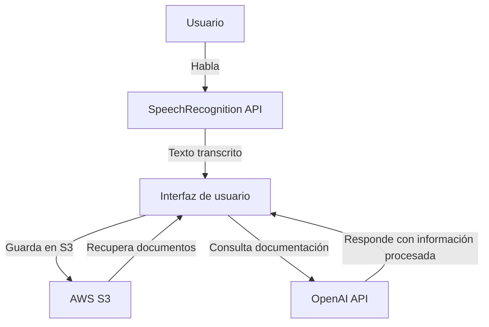

# Documentación del Proyecto

## General

### Introducción
Este código permite a los usuarios documentar procesos mediante comandos de voz y generar documentación automática. Utiliza reconocimiento de voz para transcribir y almacenar información de manera eficiente.

### Requisitos previos
- **Lenguaje:** Python
- **Versión:** 3.8+
- **Dependencias:** SpeechRecognition, OpenAI API, AWS SDK, Flask

### Instalación y configuración
1. Clona el repositorio: `git clone https://github.com/usuario/proyecto.git`
2. Instala las dependencias: `pip install -r requirements.txt`
3. Configura las credenciales de AWS y OpenAI en el archivo `.env`

### Uso básico
```python
from speech_recognition import Recognizer, Microphone
recognizer = Recognizer()
with Microphone() as source:
    audio = recognizer.listen(source)
    text = recognizer.recognize_google(audio)
    print(text)
```

## Intermedio

### Estructura del proyecto
```
proyecto/
│── app/
│   │── main.py
│   │── recognizer.py
│   │── storage.py
│── docs/
│── tests/
│── requirements.txt
│── README.md
```

### Explicación de los principales módulos o clases
- **main.py:** Maneja la lógica principal de la aplicación.
- **recognizer.py:** Se encarga del reconocimiento de voz.
- **storage.py:** Almacena y recupera datos desde AWS S3.

### Cómo contribuir
1. Realiza un fork del repositorio.
2. Crea una nueva rama con tu feature: `git checkout -b feature-nueva`
3. Sube tus cambios y abre un pull request.

## Avanzado

### Flujo de ejecución
El código sigue este flujo principal:

1. El usuario inicia la grabación de voz.
2. La API de reconocimiento de voz transcribe el audio a texto.
3. La transcripción se muestra en la interfaz de usuario.
4. Si el usuario detiene la grabación, el texto se guarda en AWS S3.
5. Si el usuario hace una pregunta, se consulta la documentación guardada en S3.
6. La OpenAI API procesa la consulta y devuelve una respuesta.
7. La respuesta se muestra en la interfaz y puede ser leída en voz alta.



### Casos de uso avanzados
- Integración con Google Drive para almacenamiento adicional.
- Exportación automática a formatos como PDF y Markdown.

### Convenciones de estilo y mejores prácticas
- Seguir PEP8 para Python.
- Uso de docstrings en funciones clave.
- Modularización para facilitar mantenimiento.

### Errores comunes y solución de problemas
- **Error en la transcripción:** Verificar que el micrófono esté funcionando.
- **Falla en almacenamiento:** Revisar credenciales de AWS.
- **API de OpenAI no responde:** Asegurar que la clave API sea válida y no esté sobre el límite de uso.
