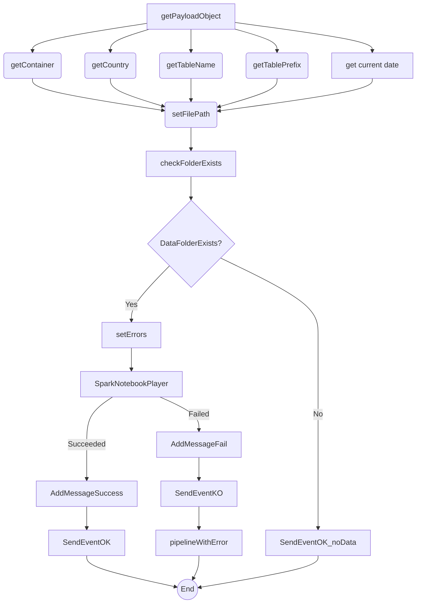

# Pipeline PL_Gen_STG_DTL

## ✅ Resumen

Este pipeline está diseñado para ejecutar un trabajo de notebook de Spark para el staging de datos de forma genérica, sin depender de un framework de orquestación externo. Construye dinámicamente rutas de archivos, verifica la existencia de datos en una carpeta especificada y ejecuta un notebook de Spark si los datos están presentes. También maneja escenarios de éxito y fracaso, enviando eventos a un pipeline de callback.

## ⚠️ Advertencias Importantes

*   **No modifiques la estructura de la variable `payload`:** El pipeline depende de una estructura específica dentro de la variable `payload`, que se deriva del parámetro del pipeline `notebook_params`. Cambiar la estructura del JSON pasado en `notebook_params` probablemente causará errores en actividades como `getContainer`, `getCountry`, `getTableName` y `getTablePrefix`. Por ejemplo, si renombras `container_name` a `data_container`, la actividad `getContainer` fallará porque no encontrará la propiedad `container_name`.
*   **Evita cambiar la lógica de concatenación de la variable `file_path`:** La actividad `setFilePath` construye la ruta del archivo basándose en varias variables. Modificar la lógica de concatenación sin comprender sus implicaciones puede llevar a rutas de archivos incorrectas y problemas de acceso a datos. Por ejemplo, eliminar la cadena `'-datasets'` alterará la estructura de carpetas esperada.
*   **Ten cuidado al alterar la expresión de la variable `current_date`:** La actividad `get current date` determina la fecha utilizada en la ruta del archivo. Cambiar la lógica, especialmente la función `addHours` o el formato de la fecha, puede llevar a que el pipeline busque datos en la partición de fecha incorrecta.
*   **Asegúrate de que el dataset `DS_Binary_BrsPrjAdls` esté configurado correctamente:** La actividad `checkFolderExists` utiliza este dataset para verificar la existencia de la carpeta de datos. Una configuración incorrecta de este dataset, como detalles de conexión o configuración de formato de archivo incorrectos, hará que el pipeline falle.

## 🐞 Posibles Errores Comunes

*   **Error:** El pipeline falla porque la carpeta no existe.
    *   **Causa:** La actividad `checkFolderExists` devuelve `false` porque la ruta de la carpeta construida en la actividad `setFilePath` es incorrecta, o los datos aún no se han cargado en la ubicación esperada.
    *   **Solución:** Verifica los valores de las variables `container`, `country`, `table_prefix`, `table_name` y `current_date`. Asegúrate de que la estructura de carpetas en el data lake coincida con la ruta construida.
*   **Error:** El notebook de Spark no se ejecuta.
    *   **Causa:** La actividad `SparkNotebookPlayer` falla debido a problemas con el pool de Spark, la configuración del notebook o los parámetros pasados al notebook.
    *   **Solución:** Verifica el estado y la configuración del pool de Spark. Verifica que los parámetros `notebook_name`, `sparkpool_name` y `notebook_params` estén configurados correctamente. Revisa los logs del notebook para obtener mensajes de error específicos.
*   **Error:** La variable `payload` no se analiza correctamente.
    *   **Causa:** La actividad `getPayloadObject` no puede analizar el parámetro `notebook_params` correctamente, a menudo debido a un formato JSON incorrecto o problemas de escape.
    *   **Solución:** Asegúrate de que el parámetro `notebook_params` sea una cadena JSON válida. Presta mucha atención al escape de caracteres especiales como las comillas. Utiliza un validador JSON para verificar el formato.
*   **Error:** Se está utilizando un formato de fecha incorrecto.
    *   **Causa:** La variable `current_date` no está en el formato esperado por la estructura de carpetas.
    *   **Solución:** Asegúrate de que la función `formatDateTime` en la actividad `get current date` esté generando el formato correcto.

## 🧩 Detalles del Notebook NTB\_Gen\_Write\_CSV\_to\_Datalake

Este notebook está diseñado para ingerir genéricamente datos desde un data lake a una base de datos de Synapse Analytics. Soporta formatos de archivo CSV y JSON, aplicación de esquema, encriptación de datos y gestión de particiones.

### Funcionalidad:

*   **Análisis de Parámetros:** Analiza los parámetros pasados desde el pipeline, incluyendo detalles de conexión, información de la tabla y configuración de archivos.
*   **Carga de Archivos:** Carga dinámicamente datos desde archivos CSV o JSON basándose en los parámetros proporcionados. Soporta la aplicación de esquemas, el manejo de esquemas faltantes y definiciones de esquemas personalizados.
*   **Encriptación de Datos:** Encripta columnas especificadas utilizando encriptación Fernet con claves almacenadas en Azure Key Vault.
*   **Preparación de Datos:** Añade columnas `processdate` y `businessdate` a los datos.
*   **Gestión de Particiones:** Gestiona particiones en la tabla de destino, eliminando las particiones existentes antes de cargar nuevos datos.
*   **Optimización de Datos:** Optimiza el almacenamiento de datos reconstruyendo las particiones si es necesario.
*   **Manejo de Errores:** Proporciona mensajes de error detallados y actualizaciones de estado.

### Parámetros Clave:

El notebook depende del parámetro `notebook_params`, que es una cadena JSON que contiene las siguientes secciones:

*   **table\_params:**
    *   `database_name`: Nombre de la base de datos de destino.
    *   `table_name`: Nombre de la tabla de destino.
    *   `business_date`: Nombre de la columna para la fecha de negocio.
    *   `business_date_fmt`: Formato de la fecha de negocio. Puede ser `yyyy-MM-dd`, `timestamp` o un patrón regex si `business_date` es `filename`.
    *   `force_field_type`: Opcional. Permite forzar el tipo de un campo. Ejemplo: `[{'field1':'string'},{'field2':'int'}]`
    *   `force_field_name`: Opcional. Permite forzar el nombre de las columnas. Ejemplo: `['col1','col2']`
    *   `force_schema`: Opcional. Permite forzar un esquema específico.
    *   `encrypt_columns`: Lista de columnas para encriptar.
    *   `flatten`: Opcional. Se utiliza para archivos JSON para especificar la columna a aplanar.
*   **params:**
    *   `table_name_prefix`: Prefijo para el nombre de la tabla.
    *   `container_name`: Nombre del contenedor en Azure Data Lake Storage.
    *   `file_type`: Tipo de archivo (CSV o JSON).
    *   `country`: Código del país.
    *   `file_path`: Ruta a los archivos de datos.
    *   `process_date`: Fecha del procesamiento de datos.
    *   `optimize`: Opcional. Si se establece, el notebook optimizará las particiones.
*   **read\_args:**
    *   Argumentos pasados al lector de Spark (por ejemplo, `sep`, `header`, `inferSchema`, `multiline`).

### Consideraciones Importantes:

*   **Encriptación de Datos:** Asegúrate de que Azure Key Vault esté configurado correctamente y que el notebook tenga acceso a la clave Fernet.
*   **Evolución del Esquema:** El notebook asume un esquema consistente entre los archivos. Si el esquema cambia, el notebook puede fallar.
*   **Particionamiento:** El notebook utiliza `processdate` y `businessdate` para el particionamiento. Asegúrate de que estas columnas estén presentes y formateadas correctamente en los datos.
*   **Rutas de Archivos:** Verifica que las rutas de los archivos sean correctas y accesibles.
*   **Dependencias:** El notebook depende de la librería `mssparkutils` y de `TokenLibrary` para acceder a los secretos de Azure Key Vault.

## 📊 Diagrama de Flujo (Mermaid.js)

