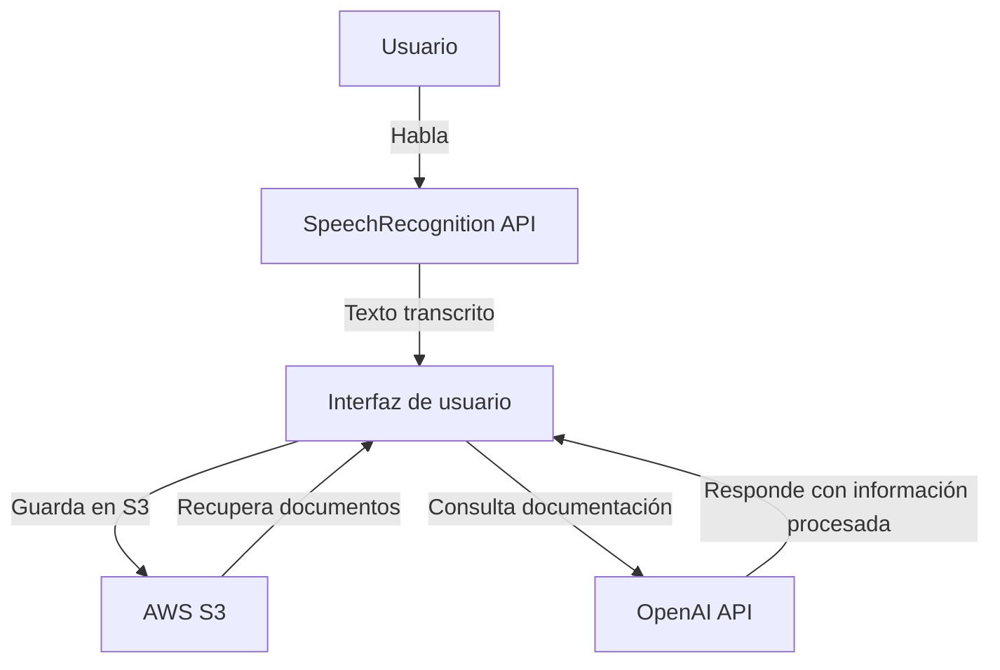

# Documentación del Código

## Introducción
Este documento describe el funcionamiento del código que implementa reconocimiento de voz en un navegador utilizando la API de SpeechRecognition. Además, almacena las transcripciones en AWS S3 y permite realizar preguntas basadas en la documentación almacenada.

## Arquitectura



## Código Fuente

```javascript
// Verifica compatibilidad con SpeechRecognition
const SpeechRecognition = window.SpeechRecognition || window.webkitSpeechRecognition;
if (!SpeechRecognition) {
    alert("Tu navegador no soporta el reconocimiento de voz.");
} else {
    const recognition = new SpeechRecognition();
    recognition.lang = "es-ES";
    recognition.continuous = false;
    recognition.interimResults = false;
    let accumulatedText = "";
    
    recognition.onresult = (event) => {
        const transcript = event.results[0][0].transcript;
        accumulatedText += transcript + " ";
        console.log("Texto reconocido:", transcript);
    };
    
    recognition.onerror = (event) => {
        console.error("Error en reconocimiento:", event.error);
    };
}
```

## Almacenamiento en AWS S3

El código guarda las transcripciones en un bucket de AWS S3. Cada usuario tiene un identificador único almacenado en `localStorage`.

```javascript
// Configuración de AWS
AWS.config.region = "us-east-1";
AWS.config.credentials = new AWS.CognitoIdentityCredentials({
    IdentityPoolId: "us-east-1:eb1fa3d7-3756-4cf6-9027-9f30eeb538b1"
});
const s3 = new AWS.S3();

function subirTextoAS3(texto) {
    let userId = localStorage.getItem("userId") || crypto.randomUUID();
    localStorage.setItem("userId", userId);
    const params = {
        Bucket: "documentations3",
        Key: `anonymous/${userId}/project1/transcripcion-${Date.now()}.txt`,
        Body: texto,
        ContentType: "text/plain"
    };
    
    s3.upload(params, function (err, data) {
        if (err) {
            console.error("Error al subir archivo:", err);
        } else {
            console.log("Archivo subido con éxito:", data.Location);
        }
    });
}
```

---

Este documento explica el funcionamiento del sistema, su estructura y código clave. Si necesitas más detalles o modificaciones, házmelo saber.
