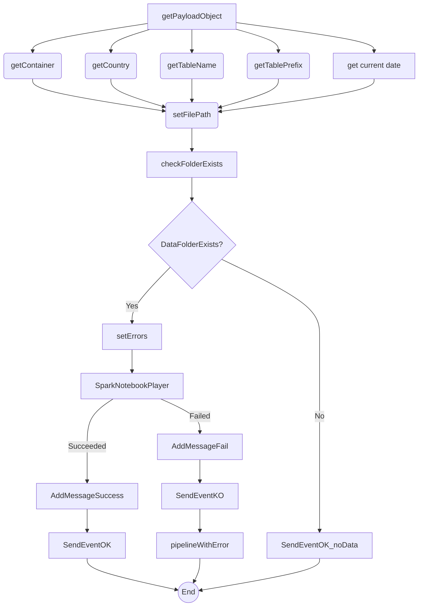

# PL_Gen_STG_DTL Pipeline

## ✅ Resumen

This pipeline is designed to execute a Spark notebook job for data staging in a generic manner, without relying on an external orchestration framework. It dynamically constructs file paths, checks for the existence of data in a specified folder, and executes a Spark notebook if data is present. It also handles success and failure scenarios, sending events to a callback pipeline.

## ⚠️ Advertencias Importantes

*   **Do not modify the `payload` variable structure:** The pipeline relies on a specific structure within the `payload` variable, which is derived from the `notebook_params` pipeline parameter. Changing the structure of the JSON passed in `notebook_params` will likely cause errors in activities like `getContainer`, `getCountry`, `getTableName`, and `getTablePrefix`. For example, if you rename `container_name` to `data_container`, the `getContainer` activity will fail because it won't find the `container_name` property.
*   **Avoid changing the `file_path` variable concatenation logic:** The `setFilePath` activity constructs the file path based on several variables. Modifying the concatenation logic without understanding its implications can lead to incorrect file paths and data access issues. For instance, removing the `'-datasets'` string will alter the expected folder structure.
*   **Be cautious when altering the `current_date` variable expression:** The `get current date` activity determines the date used in the file path. Changing the logic, especially the `addHours` function or the date format, can lead to the pipeline looking for data in the wrong date partition.
*   **Ensure the `DS_Binary_BrsPrjAdls` dataset is correctly configured:** The `checkFolderExists` activity uses this dataset to check for the existence of the data folder. Incorrect configuration of this dataset, such as wrong connection details or file format settings, will cause the pipeline to fail.

## 🐞 Posibles Errores Comunes

*   **Error:** Pipeline fails because the folder does not exist.
    *   **Cause:** The `checkFolderExists` activity returns `false` because the folder path constructed in the `setFilePath` activity is incorrect, or the data has not yet been loaded into the expected location.
    *   **Resolution:** Verify the values of the `container`, `country`, `table_prefix`, `table_name`, and `current_date` variables. Ensure that the folder structure in the data lake matches the constructed path.
*   **Error:** Spark notebook fails to execute.
    *   **Cause:** The `SparkNotebookPlayer` activity fails due to issues with the Spark pool, notebook configuration, or parameters passed to the notebook.
    *   **Resolution:** Check the Spark pool status and configuration. Verify that the `notebook_name`, `sparkpool_name`, and `notebook_params` parameters are correctly set. Review the notebook logs for specific error messages.
*   **Error:** The `payload` variable is not correctly parsed.
    *   **Cause:** The `getPayloadObject` activity fails to parse the `notebook_params` parameter correctly, often due to incorrect JSON formatting or escaping issues.
    *   **Resolution:** Ensure that the `notebook_params` parameter is a valid JSON string. Pay close attention to escaping special characters like quotes. Use a JSON validator to verify the format.
*   **Error:** Incorrect date format being used.
    *   **Cause:** The `current_date` variable is not in the format expected by the folder structure.
    *   **Resolution:** Ensure the `formatDateTime` function in the `get current date` activity is outputting the correct format.

## 📊 Diagrama de Flujo (Mermaid.js)

