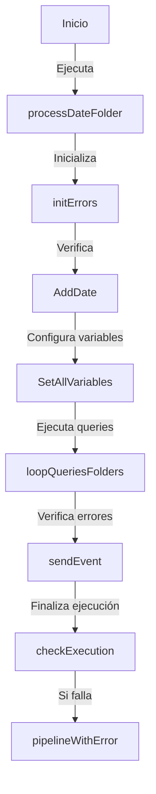

# Documentación de la Pipeline `PL_GLB_IntegrationRuntimeSQL_MSSQL`

## Descripción General
Esta pipeline ejecuta consultas de base de datos en un servidor on-premise. Se encarga de procesar datos, manejar errores y enviar eventos de orquestación. 

## Actividades

### `processDateFolder`
- **Tipo:** `SetVariable`
- **Función:** Inicializa la variable `processDateFolder` con la fecha actual en formato `yyyyMMdd`.

### `initErrors`
- **Tipo:** `SetVariable`
- **Función:** Inicializa la variable `errors` como un array vacío.

### `AddDate`
- **Tipo:** `IfCondition`
- **Función:** Agrega prefijo de fecha a los archivos si `addDate` está habilitado.

### `sendEvent`
- **Tipo:** `ExecutePipeline`
- **Función:** Llama a `PL_GLB_sendOrchestrationEvent` para enviar eventos de ejecución.

### `loopQueriesFolders`
- **Tipo:** `ForEach`
- **Función:** Ejecuta consultas en SQL Server y almacena los resultados en Azure Blob Storage.

### `checkExecution`
- **Tipo:** `IfCondition`
- **Función:** Verifica si hubo errores en la ejecución y, en caso de fallo, termina la pipeline con error.

## Parámetros

| Parámetro            | Tipo   | Valor por Defecto |
|----------------------|--------|------------------|
| fileName            | string | None             |
| addDate             | bool   | true             |
| addDateFormat       | string | yyyyMMdd         |
| event              | string | None             |
| queriesAndFolder   | array  | Lista de queries |
| queryTimeout       | string | 00:05:00         |
| containerDestination | string | -               |
| secretName_src     | string | -               |
| ingestionSource    | string | None            |
| processDate       | string | None            |
| container         | string | staging         |

## Variables

| Variable            | Tipo   |
|---------------------|--------|
| errors             | Array  |
| datePrefix         | String |
| numberOfFile       | String |
| tempError         | Array  |
| folder            | String |
| path              | String |
| error             | String |
| outputs           | Array  |
| timestamp         | String |
| folder_variables  | Array  |
| testOutput        | String |
| processDateFolder | String |

## Última publicación
- **Fecha:** 2022-02-04T21:13:21Z
