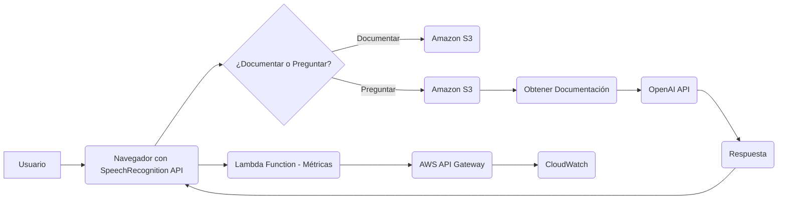

A continuación, se presenta la documentación técnica del código proporcionado.

## 📄 Descripción general del proyecto

**Nombre del código:** Speech-to-Text Documentation Tool

**Versión:** 1.0

**Explicación general:**

Este código implementa una herramienta de documentación basada en el reconocimiento de voz. Permite a los usuarios grabar audio, transcribirlo a texto y almacenarlo en un bucket de Amazon S3. Además, ofrece la funcionalidad de realizar preguntas sobre la documentación almacenada utilizando OpenAI.

**Qué problema resuelve el código:**

El código resuelve el problema de la creación y gestión de documentación de manera eficiente mediante la transcripción de voz a texto y el almacenamiento en la nube. También facilita la búsqueda de información dentro de la documentación a través de consultas a OpenAI.

## ⚙️ Visión general del sistema

**Arquitectura del sistema:**

**Tecnologías utilizadas:**

*   JavaScript
*   HTML
*   CSS (implícito en la manipulación del DOM)
*   SpeechRecognition API
*   Amazon S3
*   AWS Cognito
*   AWS Lambda
*   OpenAI API

**Dependencias:**

*   Navegador compatible con la API SpeechRecognition (Chrome, Edge, etc.)
*   AWS SDK for JavaScript
*   Cuenta de AWS con permisos para acceder a S3, Cognito e invocar la función Lambda.
*   API Key de OpenAI configurada en la función Lambda.

**Requisitos del sistema:**

*   Navegador web moderno con soporte para la API SpeechRecognition.
*   Conexión a Internet.
*   Cuenta de AWS configurada con los permisos necesarios.

**Prerrequisitos:**

*   Tener una cuenta de AWS configurada con los permisos necesarios para acceder a S3, Cognito e invocar la función Lambda.
*   Tener una API Key de OpenAI configurada en la función Lambda.
*   Incluir el SDK de AWS en el HTML.

## 📦 Guía de uso

**Cómo usarlo:**

1.  Asegúrate de tener un navegador compatible con la API SpeechRecognition.
2.  Abre la página HTML que contiene el código JavaScript.
3.  Haz clic en el botón "Start" para comenzar a grabar y transcribir tu voz.
4.  Habla claramente para que la API SpeechRecognition pueda transcribir tu voz con precisión.
5.  Haz clic en el botón "Stop" para detener la grabación y guardar la transcripción en Amazon S3.
6.  Haz clic en el botón "Ask Start" para comenzar a grabar tu pregunta.
7.  Haz clic en el botón "Ask Stop" para detener la grabación y enviar tu pregunta a OpenAI.
8.  La respuesta de OpenAI se mostrará en la interfaz.
9.  Para eliminar toda la documentación, haz clic en el icono de la papelera.

**Explicación de los pasos:**

1.  **Inicialización:**
    *   Se verifica la compatibilidad del navegador con la API SpeechRecognition.
    *   Se configura el idioma de reconocimiento según la configuración del navegador del usuario.
    *   Se inicializan variables y se obtienen referencias a los elementos HTML necesarios.
    *   Se genera un `userId` único y se almacena en el `localStorage` si no existe.
    *   Se genera un `sessionId` único y se almacena en el `sessionStorage` si no existe.
    *   Se envía una métrica de inicio de sesión a una función Lambda.
    *   Se configura AWS con Cognito para acceder a S3.
2.  **Documentar:**
    *   Al hacer clic en el botón "Start", se verifica el acceso al micrófono.
    *   Si el micrófono está disponible, se inicia la grabación y la transcripción.
    *   El texto transcrito se acumula en la variable `accumulatedText`.
    *   Al hacer clic en el botón "Stop", se detiene la grabación y se guarda el texto acumulado en Amazon S3.
    *   Se envía una métrica de documentación a una función Lambda.
3.  **Preguntar:**
    *   Al hacer clic en el botón "Ask Start", se verifica el acceso al... (The response was truncated because it has reached the token limit. Try to increase the token limit if you need a longer response.)
