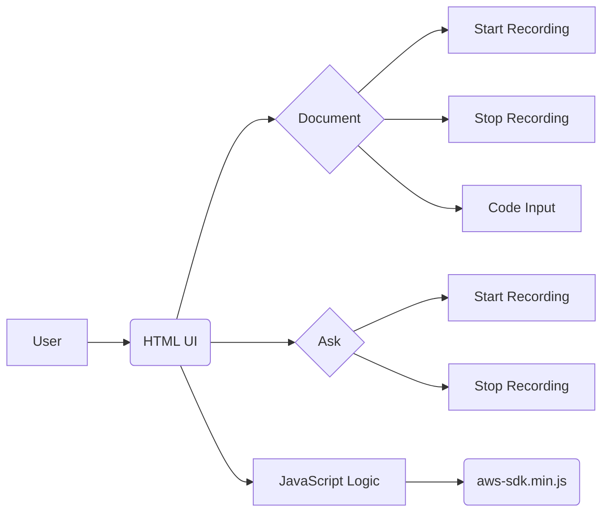

## 📄 Descripción general del proyecto

**Nombre del código:** Reconocimiento de Voz

**Versión:** 1.0

**Explicación general:**

Este código HTML define la interfaz de usuario para una aplicación de reconocimiento de voz. La aplicación permite a los usuarios documentar código mediante la voz y realizar preguntas también mediante la voz. La interfaz está dividida en dos secciones principales: "Document" y "Ask". La sección "Document" permite grabar audio para documentar el código pegado en el área de texto. La sección "Ask" permite grabar audio para formular preguntas.

**Qué problema resuelve el código:**

El código resuelve el problema de la documentación manual de código, ofreciendo una alternativa basada en la voz para agilizar el proceso. También facilita la formulación de preguntas sobre el código mediante la voz.

## ⚙️ Visión general del sistema

**Arquitectura del sistema:**



**Tecnologías utilizadas:**

*   HTML
*   CSS
*   JavaScript
*   AWS SDK for JavaScript

**Dependencias:**

*   Archivo `aws-sdk.min.js`: Proporciona acceso a los servicios de Amazon Web Services.
*   Archivo `my_script.js`: Contiene la lógica principal de la aplicación.
*   Archivo `placeholder-handler.js`: Maneja la funcionalidad del placeholder en el área de texto.
*   Google Fonts (Nunito)

**Requisitos del sistema:**

*   Navegador web moderno con soporte para JavaScript y HTML5.
*   Conexión a Internet (para cargar la fuente Nunito y el AWS SDK).

**Prerrequisitos:**

*   Tener conocimientos básicos de HTML, CSS y JavaScript.
*   Tener una cuenta de AWS configurada (si se utiliza la funcionalidad de AWS SDK).

## 📦 Guía de uso

**Cómo usarlo:**

1.  Abrir el archivo HTML en un navegador web.
2.  Para documentar código, pegar el código en el área de texto.
3.  Hacer clic en el botón "Start Recording" en la sección "Document" para comenzar a grabar la documentación de voz.
4.  Hacer clic en el botón "Stop Recording" en la sección "Document" para detener la grabación.
5.  Para hacer una pregunta, hacer clic en el botón "Start Recording" en la sección "Ask" para comenzar a grabar la pregunta.
6.  Hacer clic en el botón "Stop Recording" en la sección "Ask" para detener la grabación.
7.  La salida de la transcripción de voz se mostrará en el párrafo con el id "output".

**Explicación de los pasos (entrada, salida, parámetros):**

*   **Entrada:**
    *   Código pegado en el área de texto (para la sección "Document").
    *   Grabaciones de voz iniciadas por el usuario.
*   **Salida:**
    *   Transcripción de la voz en el párrafo con el id "output".
*   **Parámetros:**
    *   No hay parámetros definidos en el código HTML proporcionado. Los parámetros para la funcionalidad de reconocimiento de voz y AWS SDK se gestionan en los archivos JavaScript (`my_script.js`).

**Caso de uso de ejemplo:**

```html
<!DOCTYPE html>
<html>
<head>
    <title>Ejemplo de Reconocimiento de Voz</title>
</head>
<body>
    <button id="startButton">Start Recording</button>
    <p id="output">Presiona el botón para comenzar.</p>
    <script>
        document.getElementById('startButton').addEventListener('click', function() {
            document.getElementById('output').textContent = 'Grabando...';
            // Aquí iría el código para iniciar la grabación de voz
            // y transcribirla al párrafo con el id "output"
        });
    </script>
</body>
</html>
```

## 📚 Referencias

*   **HTML:** [https://developer.mozilla.org/en-US/docs/Web/HTML](https://developer.mozilla.org/en-US/docs/Web/HTML)
*   **CSS:** [https://developer.mozilla.org/en-US/docs/Web/CSS](https://developer.mozilla.org/en-US/docs/Web/CSS)
*   **JavaScript:** [https://developer.mozilla.org/en-US/docs/Web/JavaScript](https://developer.mozilla.org/en-US/docs/Web/JavaScript)
*   **AWS SDK for JavaScript:** [https://aws.amazon.com/sdk-for-javascript/](https://aws.amazon.com/sdk-for-javascript/)
*   **Web Speech API:** [https://developer.mozilla.org/en-US/docs/Web/API/Web_Speech_API](https://developer.mozilla.org/en-US/docs/Web/API/Web_Speech_API)
*   **Drag and Drop API:** [https://developer.mozilla.org/en-US/docs/Web/API/HTML_Drag_and_Drop_API](https://developer.mozilla.org/en-US/docs/Web/API/HTML_Drag_and_Drop_API)
