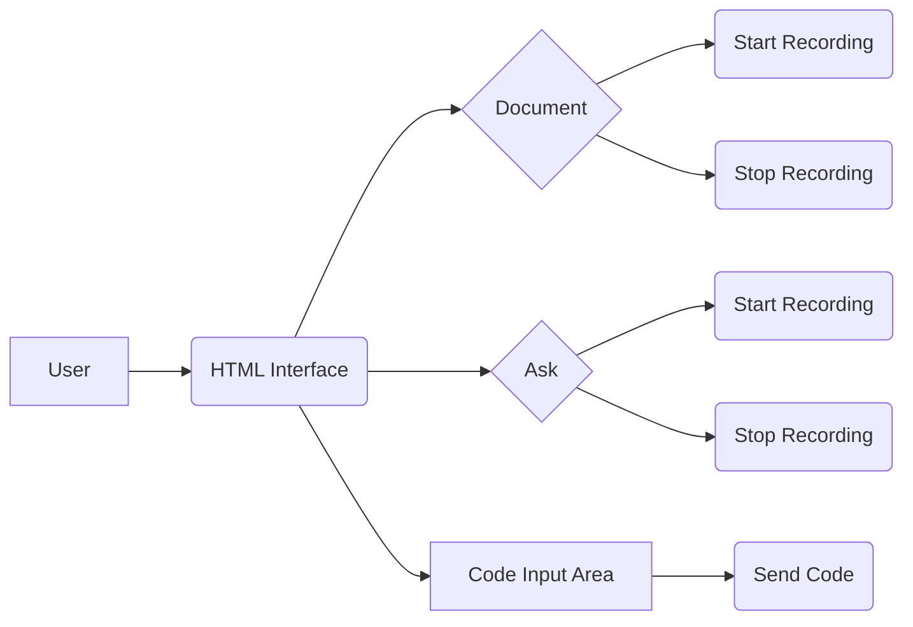

📄 Descripción general del proyecto
Nombre del código: Reconocimiento de Voz
Versión: 1.0
Explicación general:
Este código HTML define la interfaz de usuario para una aplicación de reconocimiento de voz que permite a los usuarios documentar código o hacer preguntas mediante la voz. La interfaz incluye dos secciones principales: "Document" para la documentación de código y "Ask" para realizar preguntas. También incluye un área para pegar código directamente.
Qué problema resuelve el código:
El código proporciona una interfaz para facilitar la documentación de código y la interacción mediante voz, ofreciendo una alternativa a la entrada manual.

⚙️ Visión general del sistema
Arquitectura del sistema:

Tecnologías utilizadas:
HTML, CSS, JavaScript, AWS SDK
Dependencias:
- Fuente Nunito de Google Fonts
- aws-sdk.min.js
- my_script.js
- placeholder-handler.js
Requisitos del sistema:
- Navegador web compatible con HTML5 y JavaScript
- Conexión a Internet (para la fuente Nunito y AWS SDK)
Prerrequisitos:
- Tener las librerías aws-sdk.min.js, my_script.js y placeholder-handler.js disponibles en la misma ubicación que el archivo HTML o ajustar las rutas en el código.
- Configuración de AWS SDK con las credenciales necesarias para acceder a los servicios de AWS (si `my_script.js` utiliza servicios de AWS).

📦 Guía de uso
Cómo usarlo:
1.  Abrir el archivo HTML en un navegador web compatible.
2.  Interactuar con la sección "Document" para iniciar y detener la grabación de voz para la documentación.
3.  Interactuar con la sección "Ask" para iniciar y detener la grabación de voz para realizar preguntas.
4.  Pegar código en el área de entrada de código para documentarlo.
5.  Hacer clic en el botón "Generar Documentación" después de pegar el código.
Explicación de los pasos:
*   Entrada:
    *   Interacción del usuario con los botones "Start Recording" y "Stop Recording" en las secciones "Document" y "Ask".
    *   Pegado de código en el área de texto designada.
*   Salida:
    *   El texto reconocido de la voz se muestra en el elemento con el ID "output".
    *   La documentación generada a partir del código pegado (la forma en que se muestra esta documentación depende de la lógica implementada en `my_script.js`).
*   Parámetros:
    *   No hay parámetros explícitos definidos en el HTML. Los parámetros se gestionan en los archivos JavaScript asociados (`aws-sdk.min.js`, `my_script.js`, `placeholder-handler.js`).
Caso de uso de ejemplo:
```html
<!DOCTYPE html>
<html>
<head>
    <title>Ejemplo de Reconocimiento de Voz</title>
</head>
<body>
    <button id="start">Iniciar</button>
    <button id="stop">Detener</button>
    <p id="result">Aquí se mostrará el resultado</p>

    <script>
        document.getElementById('start').addEventListener('click', function() {
            document.getElementById('result').textContent = 'Grabando...';
        });

        document.getElementById('stop').addEventListener('click', function() {
            document.getElementById('result').textContent = 'Procesando...';
            // Simulación de procesamiento
            setTimeout(function() {
                document.getElementById('result').textContent = 'Texto reconocido: Hola mundo!';
            }, 2000);
        });
    </script>
</body>
</html>
```

📚 Referencias
*   HTML Standard: [https://html.spec.whatwg.org/](https://html.spec.whatwg.org/)
*   CSS Specifications: [https://www.w3.org/Style/CSS/specs.en.html](https://www.w3.org/Style/CSS/specs.en.html)
*   JavaScript MDN: [https://developer.mozilla.org/en-US/docs/Web/JavaScript](https://developer.mozilla.org/en-US/docs/Web/JavaScript)
*   AWS SDK for JavaScript: [https://aws.amazon.com/sdk-for-javascript/](https://aws.amazon.com/sdk-for-javascript/)
*   Web Speech API: [https://developer.mozilla.org/en-US/docs/Web/API/Web_Speech_API](https://developer.mozilla.org/en-US/docs/Web/API/Web_Speech_API)
