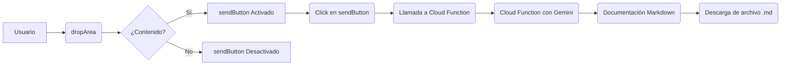

## 📄 Descripción general del proyecto

-   **Nombre del código:** Frontend de Documentación con Gemini
-   **Versión:** 1.0
-   **Explicación general:** Este código frontend permite a los usuarios ingresar código en un área de texto, enviarlo a una Cloud Function para su documentación utilizando Gemini, y descargar la documentación resultante en formato Markdown.
-   **Qué problema resuelve el código:** Facilita la generación de documentación para código fuente al proporcionar una interfaz de usuario simple para ingresar el código y descargar la documentación generada.

## ⚙️ Visión general del sistema



-   **Tecnologías utilizadas:** HTML, CSS, JavaScript
-   **Dependencias:** Ninguna
-   **Requisitos del sistema:** Navegador web moderno con soporte para JavaScript.
-   **Prerrequisitos:** Ninguno

## 📦 Guía de uso

### Cómo usarlo

1.  Cargar la página HTML en un navegador web.
2.  Ingresar el código a documentar en el área de texto designada (dropArea).
3.  Hacer clic en el botón "Enviar" (sendButton).
4.  Descargar el archivo Markdown generado con la documentación.

### Explicación de los pasos

-   **Entrada:** Código fuente a documentar ingresado en el área de texto (dropArea).
-   **Salida:** Archivo Markdown (`documentacion.md`) que contiene la documentación generada.
-   **Parámetros:** Ninguno en el frontend. El código fuente se envía como un string en el cuerpo de la solicitud POST a la Cloud Function.

### Caso de uso de ejemplo:

```javascript
// Ejemplo de uso del frontend para documentar una función simple
// 1. El usuario ingresa el siguiente código en el área de texto:
function suma(a, b) {
  return a + b;
}

// 2. El usuario hace clic en el botón "Enviar".
// 3. El frontend envía el código a la Cloud Function.
// 4. La Cloud Function genera la documentación y la devuelve al frontend.
// 5. El frontend descarga un archivo llamado "documentacion.md" con el siguiente contenido:

/*
## Función Suma

Esta función toma dos números como entrada y devuelve su suma.

**Parámetros:**

- `a`: El primer número.
- `b`: El segundo número.

**Retorno:**

La suma de `a` y `b`.

**Ejemplo:**

```javascript
const resultado = suma(5, 3); // resultado será 8
```
*/


## 🔐 Documentación de la API

-   **Endpoint:** `https://callgemini-397605286686.us-central1.run.app`
-   **Formatos de solicitud y respuesta:**
    -   Solicitud: `POST` con `Content-Type: application/json` y un cuerpo JSON que contiene el código fuente:

    ```json
    {
    "code": "código fuente a documentar"
    }
    ```

    -   Respuesta: Texto plano con la documentación en formato Markdown.
-   **Autenticación y autorización:** No especificada en el código proporcionado. Se asume que la Cloud Function no requiere autenticación o autorización para recibir solicitudes.

## 📚 Referencias

-   **Fetch API:** [https://developer.mozilla.org/en-US/docs/Web/API/Fetch_API](https://developer.mozilla.org/en-US/docs/Web/API/Fetch_API)
-   **Blob:** [https://developer.mozilla.org/en-US/docs/Web/API/Blob](https://developer.mozilla.org/en-US/docs/Web/API/Blob)
-   **URL.createObjectURL():** [https://developer.mozilla.org/en-US/docs/Web/API/URL/createObjectURL](https://developer.mozilla.org/en-US/docs/Web/API/URL/createObjectURL)
-   **Markdown:** [https://www.markdownguide.org/](https://www.markdownguide.org/)
