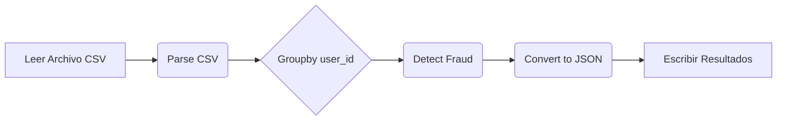

## 📄 Descripción general del proyecto

-   **Nombre del código:** Detección de Fraude en Transacciones
-   **Versión:** 1.0
-   **Explicación general:** Este código implementa un pipeline de Apache Beam para detectar transacciones fraudulentas en un conjunto de datos CSV. El pipeline lee datos de transacciones, aplica reglas de detección de fraude y escribe las transacciones sospechosas en un archivo JSON.
-   **Qué problema resuelve el código:** El código aborda el problema de identificar patrones de fraude en transacciones financieras, como cambios rápidos de país, uso de múltiples tarjetas en el mismo teléfono, grandes cantidades de transacción y transacciones rápidas.

## ⚙️ Visión general del sistema



-   **Tecnologías utilizadas:**
    *   Apache Beam
    *   Python
    *   Google Cloud Dataflow (opcional)
-   **Dependencias:**
    *   apache-beam
    *   Python 3.6+
-   **Requisitos del sistema:**
    *   Entorno de Python configurado.
    *   Acceso a Google Cloud Platform (GCP) si se utiliza Dataflow.
-   **Prerrequisitos:**
    *   Instalar la librería `apache-beam`.
    *   Si se usa Google Cloud Dataflow, configurar las credenciales de GCP y habilitar la API de Dataflow.

## 📦 Guía de uso

-   **Cómo usarlo:** El script se ejecuta directamente desde la línea de comandos de Python. Se deben especificar las rutas de entrada (archivo CSV de transacciones) y salida (archivo JSON para resultados).
-   **Explicación de los pasos:**
    1.  **Entrada:** Archivo CSV que contiene datos de transacciones con campos como `transaction_id`, `user_id`, `amount`, `origin_country`, `destination_country`, `payment_method`, `timestamp`, `card_number`, y `phone_number`.
    2.  **Procesamiento:** El pipeline de Apache Beam lee el archivo CSV, parsea cada línea en un diccionario, agrupa las transacciones por `user_id`, aplica reglas de detección de fraude y convierte las transacciones sospechosas a formato JSON.
    3.  **Salida:** Archivo JSON que contiene una lista de transacciones sospechosas, cada una con un campo adicional `fraud_reason` que indica la razón por la cual se considera sospechosa.
-   **Caso de uso de ejemplo:**

```python
import json
from datetime import datetime

# Simulación de una transacción
transaction_data = {
    'transaction_id': '123',
    'user_id': 'user1',
    'amount': 1200.0,
    'origin_country': 'US',
    'destination_country': 'CA',
    'payment_method': 'credit_card',
    'timestamp': '11/02/2024 10:30',
    'card_number': 'XXXX-XXXX-XXXX-1234',
    'phone_number': '555-123-4567'
}

# Función para convertir timestamp al formato esperado
def to_unix_timestamp(timestamp_str):
    dt = datetime.strptime(timestamp_str, "%m/%d/%Y %H:%M")
    return int(dt.timestamp())

# Simulación de la función flag_large_amounts (una de las reglas de fraude)
def flag_large_amounts(transactions):
    return [txn | {'fraud_reason': 'Large transaction amount'} for txn in transactions if txn['amount'] > 1000]

# Aplicar la regla de fraude
suspicious_transactions = flag_large_amounts([transaction_data])

# Imprimir el resultado en formato JSON si hay transacciones sospechosas
if suspicious_transactions:
    print(json.dumps(suspicious_transactions, indent=4))
else:
    print("No suspicious transactions found.")
```

## 🔐 Documentación de la API

Esta sección no aplica ya que el código no expone una API.

## 📚 Referencias

*   [Apache Beam Programming Guide](https://beam.apache.org/documentation/programming-guide/)
*   [Google Cloud Dataflow Documentation](https://cloud.google.com/dataflow/docs)
*   [Datetime documentation](https://docs.python.org/3/library/datetime.html)
