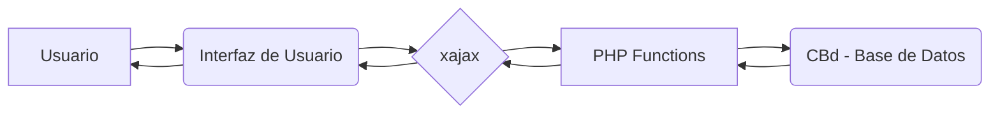

```
1. 📄 Descripción general del proyecto
  - Nombre del código: Facturación Empresarial
  - Versión: N/A
  - Explicación general: Este código PHP proporciona funcionalidades para la gestión de facturas empresariales, incluyendo la visualización, validación, generación y envío de facturas, así como la gestión de lotes de facturas y la generación de informes relacionados.
  - Qué problema resuelve el código: Facilita la gestión del proceso de facturación empresarial, desde la validación inicial hasta la generación de informes y el envío de facturas, permitiendo un control centralizado y automatizado del flujo de trabajo.

2. ⚙️ Visión general del sistema
  - Arquitectura del sistema:



  - Tecnologías utilizadas: PHP, JavaScript (xajax), PostgreSQL.
  - Dependencias:
    - `sys_config_api.php`: Archivo de configuración del sistema.
    - xajax: Librería JavaScript para realizar llamadas asíncronas al servidor.
    - CBd: Clase para la gestión de la conexión a la base de datos PostgreSQL.
  - Requisitos del sistema:
    - Servidor web con soporte para PHP.
    - Extensión PostgreSQL para PHP.
    - Base de datos PostgreSQL.
  - Prerrequisitos:
    - Configuración correcta de la base de datos en `sys_config_api.php`.
    - Instalación y configuración de la librería xajax.
    - Existencia de las tablas y funciones de la base de datos utilizadas por las consultas SQL.

3. 📦 Guía de uso
  - Cómo usarlo: El código define varias funciones que se utilizan para interactuar con la base de datos y realizar operaciones relacionadas con la facturación empresarial. Estas funciones se exponen a través de la librería xajax para ser llamadas desde el lado del cliente (JavaScript).
  - Explicación de los pasos (entrada, salida, parámetros):
    - **`listarFacturasEmpAValidar($ciudad)`**:
        - Entrada: `$ciudad` (integer) - ID de la ciudad.
        - Salida: Tabla HTML con la lista de compañías y el número de facturas a validar.
        - Parámetros: `$ciudad` (ID de la ciudad para filtrar las facturas).
    - **`listarFacturasEmpEnviadas($datos)`**:
        - Entrada: `$datos` (array) - Array con la ciudad, año y mes.
        - Salida: Tabla HTML con la lista de facturas enviadas.
        - Parámetros: `$datos[0]` (ID de la ciudad), `$datos[1]` (año), `$datos[2]` (mes).
    - **`validarFacturasParaEnvioMasivo($datos)`**:
        - Entrada: `$datos` (array) - Array con la ciudad y la compañía.
        - Salida: Mensaje de éxito o error indicando el resultado de la validación.
        - Parámetros: `$datos[0]` (ID de la ciudad), `$datos[1]` (ID de la compañía).
    - **`generarFacturasParaEnvioMasivo($datos)`**:
        - Entrada: `$datos` (array) - Array con la ciudad.
        - Salida: Mensaje de éxito o error indicando el resultado de la generación de facturas.
        - Parámetros: `$datos[0]` (ID de la ciudad).
    - **`validarFacturasConListadoEnvio($datos)`**:
        - Entrada: `$datos` (array) - Array con la ciudad, año y mes.
        - Salida: Mensaje de éxito o error indicando el resultado de la validación.
        - Parámetros: `$datos[0]` (ID de la ciudad), `$datos[1]` (año), `$datos[2]` (mes).
    - **`marcarFacturaParaEnvio($idFactura, $datos, $tipoMarcacion = 0)`**:
        - Entrada: `$idFactura` (integer), `$datos` (array), `$tipoMarcacion` (integer, opcional).
        - Salida: Mensaje de éxito o error indicando el resultado de la marcación.
        - Parámetros: `$idFactura` (ID de la factura), `$datos` (array con la ciudad, año y mes), `$tipoMarcacion` (0 para marcar para envío, 1 para marcar como enviado manualmente).
    - **`generarFacturaIndividualEmpresarial($idFactura)`**:
        - Entrada: `$idFactura` (integer).
        - Salida: Mensaje de éxito o error indicando el resultado de la generación de la factura.
        - Parámetros: `$idFactura` (ID de la factura).
    - **`marcarLoteParaEnvio($idLote, $datos, $tipoMarcacion = 0)`**:
        - Entrada: `$idLote` (integer), `$datos` (array), `$tipoMarcacion` (integer, opcional).
        - Salida: Mensaje de éxito o error indicando el resultado de la marcación del lote.
        - Parámetros: `$idLote` (ID del lote), `$datos` (array con la ciudad, año y mes), `$tipoMarcacion` (0 para marcar para envío, 1 para marcar como enviado manualmente).
    - **`cargarInformacionLTEmpresarial($idLt)`**:
        - Entrada: `$idLt` (integer).
        - Salida: Información del lote empresarial (cliente, referencia, fecha, valor, contrato, saldo).
        - Parámetros: `$idLt` (ID del lote empresarial).
    - **`ajustarLTACausacionFactura($idLt)`**:
        - Entrada: `$idLt` (integer).
        - Salida: Mensaje de éxito o error indicando el resultado del ajuste.
        - Parámetros: `$idLt` (ID del lote empresarial).
    - **`anularLTAFactura($idLt, $idDiario, $motivo)`**:
        - Entrada: `$idLt` (integer), `$idDiario` (integer), `$motivo` (string).
        - Salida: Mensaje de éxito o error indicando el resultado de la anulación.
        - Parámetros: `$idLt` (ID del lote empresarial), `$idDiario` (ID del diario), `$motivo` (motivo de la anulación).
    - **`rpListadoFacturacionLT($idLT)`**:
        - Entrada: `$idLT` (integer).
        - Salida: Generación de un listado de facturación y mensaje de éxito o error.
        - Parámetros: `$idLT` (ID del lote).
    - **`rpListadoFacturacionExcel($idLineaFacturacionEmp)`**:
        - Entrada: `$idLineaFacturacionEmp` (integer).
        - Salida: Generación de un archivo Excel con el listado de facturación y mensaje de éxito o error.
        - Parámetros: `$idLineaFacturacionEmp` (ID de la línea de facturación empresarial).

  - Caso de uso de ejemplo:

```php
<?php
require_once 'sys_config_api.php';

// Simulación de la llamada a la función listarFacturasEmpAValidar desde un script PHP.
// En un entorno real, esta llamada se realizaría desde JavaScript utilizando xajax.
$ciudad_id = 123; // ID de la ciudad para la que se quieren listar las facturas.

// Creación de una instancia de la clase xajaxResponse para simular la respuesta.
class xajaxResponse {
    public function assign($elementId, $property, $value) {
        echo "Asignando el valor '$value' a la propiedad '$property' del elemento '$elementId'.\n";
    }

    public function script($script) {
        echo "Ejecutando el script: '$script'.\n";
    }
}

// Llamada a la función listarFacturasEmpAValidar.
$response = listarFacturasEmpAValidar($ciudad_id);

// En un entorno real, la respuesta se enviaría al cliente a través de xajax.
// Aquí, simplemente se imprime la respuesta en la consola.
```

4. 🔐 Documentación de la API 
  - Endpoints: Las funciones PHP se registran con xajax, lo que las convierte en endpoints accesibles a través de solicitudes AJAX desde el cliente. Por ejemplo, `xajax_listarFacturasEmpAValidar`, `xajax_listarFacturasEmpEnviadas`, etc.
  - Formatos de solicitud y respuesta:
    - Solicitud: Las solicitudes se realizan mediante llamadas AJAX a las funciones registradas en xajax. Los parámetros se pasan como argumentos a la función.
    - Respuesta: Las funciones devuelven un objeto `xajaxResponse` que contiene instrucciones para actualizar la interfaz de usuario en el cliente (por ejemplo, asignar valores a elementos HTML, ejecutar scripts JavaScript).
  - Autenticación y autorización: El código asume que la autenticación y autorización se manejan externamente. La variable `$_SESSION['userid']` se utiliza para obtener el ID del usuario actual, pero no se proporciona información sobre cómo se establece esta variable.

5. 📚 Referencias
  - xajax: [http://xajax.sourceforge.net/](http://xajax.sourceforge.net/)
  - PostgreSQL: [https://www.postgresql.org/docs/](https://www.postgresql.org/docs/)
  - SQL: [https://www.w3schools.com/sql/](https://www.w3schools.com/sql/)
```