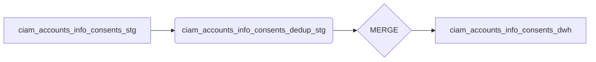

## 📄 Descripción general del proyecto

-   **Nombre del código:** `sp_ciam_accounts_info_consents`
-   **Versión:** N/A
-   **Explicación general:** Este stored procedure en SQL Server está diseñado para consolidar y actualizar la información de consentimientos de cuentas CIAM (Customer Identity and Access Management) en un data warehouse. El procedimiento maneja la creación de la tabla de destino si no existe, la deduplicación de datos entrantes y la actualización o inserción de registros en la tabla de destino.
-   **Qué problema resuelve el código:** El código resuelve el problema de mantener actualizada la información de consentimientos de usuarios en un entorno de data warehouse, gestionando la deduplicación de datos y la actualización incremental basada en la fecha de última modificación.

## ⚙️ Visión general del sistema



-   **Tecnologías utilizadas:**
    -   SQL Server
-   **Dependencias:**
    -   Tabla de staging: `chl_stg.ciam_accounts_info_consents`
-   **Requisitos del sistema:**
    -   SQL Server con permisos para crear tablas y stored procedures.
-   **Prerrequisitos:**
    -   La tabla de staging `chl_stg.ciam_accounts_info_consents` debe existir y contener los datos a procesar.

## 📦 Guía de uso

-   **Cómo usarlo:** Ejecutar el stored procedure `[chl_dwh].[sp_ciam_accounts_info_consents]` sin parámetros. El procedimiento se encarga de leer los datos de la tabla de staging, realizar la deduplicación y actualizar la tabla de destino.
-   **Explicación de los pasos:**
    1.  **Entrada:** Datos en la tabla de staging `chl_stg.ciam_accounts_info_consents`.
    2.  **Proceso:**
        -   Crea la tabla `chl_dwh.ciam_accounts_info_consents` si no existe.
        -   Crea una tabla temporal `chl_stg.ciam_accounts_info_consents_dedup` para deduplicar los datos de la tabla de staging, seleccionando el registro más reciente para cada `UID`.
        -   Realiza un `MERGE` en la tabla de destino `chl_dwh.ciam_accounts_info_consents` para insertar nuevos registros o actualizar los existentes basándose en el `UID` y la fecha de última actualización (`ciam_lastupdated`).
        -   Elimina la tabla temporal de deduplicación y la tabla de staging.
    3.  **Salida:** Datos actualizados en la tabla `chl_dwh.ciam_accounts_info_consents`.
    4.  **Parámetros:** El stored procedure acepta un parámetro `@PARAMS` de tipo `NVARCHAR(MAX)`, pero no se utiliza dentro del código.

-   **Caso de uso de ejemplo:**

```sql
-- Asumiendo que la tabla chl_stg.ciam_accounts_info_consents ya está poblada
-- con datos desde una fuente externa.

-- Ejecutar el stored procedure para consolidar los datos en el DWH.
EXEC [chl_dwh].[sp_ciam_accounts_info_consents] @PARAMS = NULL;

-- Verificar los resultados en la tabla de destino.
SELECT * FROM [chl_dwh].[ciam_accounts_info_consents];
```

## 🔐 Documentación de la API

N/A

## 📚 Referencias

-   **MERGE Statement (Transact-SQL):** [https://learn.microsoft.com/en-us/sql/t-sql/statements/merge-transact-sql?view=sql-server-ver16](https://learn.microsoft.com/en-us/sql/t-sql/statements/merge-transact-sql?view=sql-server-ver16)
-   **ROW_NUMBER (Transact-SQL):** [https://learn.microsoft.com/en-us/sql/t-sql/functions/row-number-transact-sql?view=sql-server-ver16](https://learn.microsoft.com/en-us/sql/t-sql/functions/row-number-transact-sql?view=sql-server-ver16)
-   **Clustered Columnstore Indexes:** [https://learn.microsoft.com/en-us/sql/relational-databases/indexes/columnstore-indexes-overview?view=sql-server-ver16](https://learn.microsoft.com/en-us/sql/relational-databases/indexes/columnstore-indexes-overview?view=sql-server-ver16)