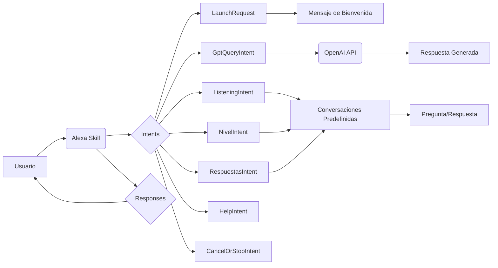

## 📄 Descripción general del proyecto

-   **Nombre del código:** Tutor de Idiomas
-   **Versión:** 1.0
-   **Explicación general:** Este código implementa una skill de Alexa para la práctica de idiomas, permitiendo a los usuarios interactuar en inglés o español para mejorar sus habilidades lingüísticas. La skill utiliza la API de OpenAI para generar respuestas y mantener conversaciones fluidas. Además, ofrece ejercicios de escucha interactivos con diferentes niveles de dificultad.
-   **Qué problema resuelve el código:** Facilita el aprendizaje y la práctica de idiomas a través de conversaciones interactivas y ejercicios de escucha, adaptándose al nivel y preferencias del usuario.

## ⚙️ Visión general del sistema

-   **Arquitectura del sistema:**



-   **Tecnologías utilizadas:**
    -   Python
    -   Alexa Skills Kit SDK for Python
    -   OpenAI API
    -   boto3 (AWS SDK for Python)
-   **Dependencias:**
    -   ask-sdk-core
    -   ask-sdk-model
    -   openai
    -   json
    -   unicodedata
    -   requests
    -   boto3
    -   uuid
    -   datetime
-   **Requisitos del sistema:**
    -   Cuenta de desarrollador de Amazon Alexa
    -   Cuenta de OpenAI con API key válida
    -   Cuenta de AWS con permisos para acceder a DynamoDB
    -   Python 3.6 o superior
-   **Prerrequisitos:**
    -   Configuración de las credenciales de AWS
    -   Instalación de las dependencias de Python (`pip install ask-sdk-core ask-sdk-model openai requests boto3`)
    -   Creación de una tabla en DynamoDB con el nombre '48cd8557-41e4-41a8-904e-d6f37e536a65' y los atributos 'id', 'deviceId', 'insertDatetime', 'environment' y 'language'.

## 📦 Guía de uso

-   **Cómo usarlo:**
    1.  Invoca la skill de Alexa diciendo "Abrir Tutor de Idiomas".
    2.  Para practicar la conversación, responde a las preguntas que te haga Alexa.
    3.  Para iniciar un ejercicio de escucha, di "Practicar escucha".
    4.  Selecciona un nivel de dificultad (fácil, medio, difícil).
    5.  Responde a las preguntas de opción múltiple.
-   **Explicación de los pasos (entrada, salida, parámetros):**
    -   **Entrada:** Comandos de voz del usuario.
    -   **Salida:** Respuestas de voz de Alexa, preguntas interactivas, retroalimentación sobre las respuestas.
    -   **Parámetros:**
        -   `query` (en `GptQueryIntent`): Frase o pregunta del usuario para interactuar con el modelo de lenguaje.
        -   `nivel` (en `NivelIntent`): Nivel de dificultad seleccionado por el usuario (fácil, medio, difícil).
        -   `opcion` (en `RespuestasIntent`): Opción seleccionada por el usuario en los ejercicios de escucha (a, b, c, d).
-   **Caso de uso de ejemplo:**

```python
# Ejemplo de uso del intent RespuestasIntentHandler
# Asumiendo que el usuario ha iniciado un ejercicio de escucha y se le ha presentado una pregunta

def simular_respuesta_usuario(handler_input, opcion_elegida):
    """Simula la respuesta del usuario a una pregunta de opción múltiple."""
    handler_input.request_envelope.request.intent.slots = {
        "opcion": {
            "name": "opcion",
            "value": opcion_elegida,
            "resolutions": {
                "resolutionsPerAuthority": [
                    {
                        "authority": "amzn1.er-authority.ek2yqeq",
                        "status": {
                            "code": "ER_SUCCESS_MATCH"
                        },
                        "values": [
                            {
                                "value": {
                                    "name": opcion_elegida,
                                    "id": opcion_elegida
                                }
                            }
                        ]
                    }
                ]
            },
            "confirmationStatus": "NONE",
            "source": "USER"
        }
    }
    return RespuestasIntentHandler().handle(handler_input)

# Ejemplo de uso:
# Asumiendo que 'handler_input' ya está definido y configurado
# El usuario elige la opción 'a'
# respuesta = simular_respuesta_usuario(handler_input, "a")
# print(respuesta)
```

## 🔐 Documentación de la API

-   **Endpoints:** No aplica, ya que es una skill de Alexa y no expone endpoints HTTP.
-   **Formatos de solicitud y respuesta:** No aplica, ya que la interacción se basa en comandos de voz y respuestas de voz.
-   **Autenticación y autorización:** La autenticación se realiza a través de la plataforma de Amazon Alexa. La autorización se basa en los permisos concedidos a la skill por el usuario.

## 📚 Referencias

-   [Alexa Skills Kit SDK for Python](https://developer.amazon.com/en-US/docs/alexa/alexa-skills-kit-sdk-for-python/overview.html)
-   [OpenAI API](https://platform.openai.com/docs/api-reference)
-   [boto3 Documentation](https://boto3.amazonaws.com/v1/documentation/api/index.html)
-   [UUID](https://docs.python.org/3/library/uuid.html)
-   [Datetime](https://docs.python.org/3/library/datetime.html)
