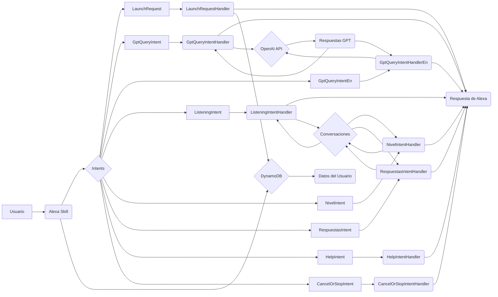

## 📄 Descripción general del proyecto

*   **Nombre del código:** Tutor de Idiomas
*   **Versión:** 1.0
*   **Explicación general:** Este código implementa una skill de Alexa para la práctica de idiomas, principalmente español e inglés. Permite a los usuarios conversar con un asistente virtual, practicar la comprensión auditiva a través de ejercicios de diferentes niveles, y mejorar sus habilidades de expresión oral. Utiliza la API de OpenAI para generar respuestas y mantener conversaciones fluidas.
*   **Qué problema resuelve el código:** Facilita el aprendizaje y la práctica de idiomas a través de una skill de Alexa, ofreciendo conversaciones interactivas y ejercicios de comprensión auditiva personalizados.

## ⚙️ Visión general del sistema

*   **Arquitectura del sistema:**



*   **Tecnologías utilizadas:**
    *   Python
    *   Alexa Skills Kit SDK for Python
    *   OpenAI API
    *   boto3 (AWS SDK for Python)
*   **Dependencias:**
    *   ask-sdk-core
    *   ask-sdk-model
    *   openai
    *   json
    *   unicodedata
    *   requests
    *   boto3
    *   uuid
    *   datetime
*   **Requisitos del sistema:**
    *   Cuenta de Amazon Developer
    *   Cuenta de OpenAI
    *   Cuenta de AWS (para DynamoDB)
*   **Prerrequisitos:**
    *   Configuración de una skill de Alexa en la consola de Amazon Developer.
    *   Instalación de las dependencias de Python.
    *   Configuración de las credenciales de AWS.
    *   Archivo `conf_credentials.json` con la API key de OpenAI.

## 📦 Guía de uso

*   **Cómo usarlo:**
    1.  Invoca la skill de Alexa diciendo "Abrir Tutor de Idiomas".
    2.  Sigue las instrucciones de la skill para practicar la conversación en español o inglés, o para realizar ejercicios de comprensión auditiva.
    3.  Para la práctica de conversación, responde a las preguntas del asistente.
    4.  Para los ejercicios de comprensión auditiva, elige un nivel (fácil, medio, difícil) y responde a las preguntas.
*   **Explicación de los pasos (entrada, salida, parámetros):**
    *   **Entrada:** Comandos de voz del usuario a través de Alexa.
    *   **Salida:** Respuestas de voz de Alexa, preguntas para mantener la conversación, ejercicios de comprensión auditiva, retroalimentación sobre las respuestas del usuario.
    *   **Parámetros:**
        *   `query` (en `GptQueryIntent` y `GptQueryIntentEn`): Frase o pregunta del usuario para la conversación.
        *   `nivel` (en `NivelIntent`): Nivel de dificultad elegido por el usuario (fácil, medio, difícil).
        *   `opcion` (en `RespuestasIntent`): Respuesta del usuario a las preguntas de los ejercicios de comprensión auditiva.
*   **Caso de uso de ejemplo:**

```python
from ask_sdk_core.handler_input import HandlerInput
from ask_sdk_model import Response
from skill import RespuestasIntentHandler  # Importa la clase del código original

# Simula un HandlerInput con la respuesta del usuario
class MockHandlerInput:
    def __init__(self, opcion):
        self.request_envelope = MockRequestEnvelope(opcion)
        self.attributes_manager = MockAttributesManager()

class MockRequestEnvelope:
    def __init__(self, opcion):
        self.request = MockRequest(opcion)

class MockRequest:
    def __init__(self, opcion):
        self.intent = MockIntent(opcion)

class MockIntent:
    def __init__(self, opcion):
        self.slots = {"opcion": MockSlot(opcion)}

class MockSlot:
    def __init__(self, opcion):
        self.value = opcion

class MockAttributesManager:
    def __init__(self):
        self.session_attributes = {'indice_pregunta': 0, 'nivel_actual': [("Pregunta 1", "a"), ("Pregunta 2", "b")], 'en_conversacion': True}

    def get_session_attributes(self):
        return self.session_attributes

# Crea una instancia del Intent y simula la entrada del usuario
handler = RespuestasIntentHandler()
mock_input = MockHandlerInput(opcion="a")  # El usuario responde "a"

# Ejecuta el Intent
response: Response = handler.handle(mock_input)

# Imprime la respuesta de Alexa
print(response.output_speech.text)
```

## 🔐 Documentación de la API

*   **Endpoints:** No aplica, ya que es una skill de Alexa y no una API web.
*   **Formatos de solicitud y respuesta:** No aplica, ya que la interacción se realiza a través de comandos de voz y respuestas de voz de Alexa.
*   **Autenticación y autorización:** La autenticación se realiza a través de la cuenta de Amazon del usuario. La autorización se gestiona a través de los permisos configurados en la skill de Alexa.

## 📚 Referencias

*   [Alexa Skills Kit SDK for Python](https://developer.amazon.com/en-US/docs/alexa/ask-sdk/index.html)
*   [OpenAI API](https://openai.com/docs/api-reference)
*   [boto3 Documentation](https://boto3.amazonaws.com/v1/documentation/api/index.html)
*   [UUID](https://docs.python.org/3/library/uuid.html)
*   [Datetime](https://docs.python.org/3/library/datetime.html)
