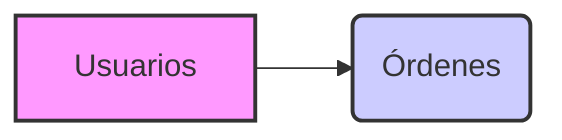

## 📄 Descripción general del proyecto

-   **Nombre del código:** Consultas SQL para gestión de usuarios y órdenes
-   **Versión:** 1.0
-   **Explicación general:** Este código SQL define la estructura de una base de datos para gestionar usuarios y sus órdenes, inserta datos de prueba y realiza una consulta para obtener el total gastado por usuarios activos.
-   **Qué problema resuelve el código:** Facilita la gestión de información de usuarios y sus órdenes, permitiendo obtener análisis sobre el gasto de los usuarios activos.

## ⚙️ Visión general del sistema



-   **Tecnologías utilizadas:** SQL
-   **Dependencias:** Ninguna
-   **Requisitos del sistema:** Un sistema de gestión de bases de datos relacional (RDBMS) compatible con SQL, como MySQL, PostgreSQL o SQLite.
-   **Prerrequisitos:** Conocimientos básicos de SQL y un RDBMS instalado y configurado.

## 📦 Guía de uso

#### Cómo usarlo

1.  Ejecutar los scripts SQL en un RDBMS.
2.  Analizar los resultados de la consulta para obtener el total gastado por usuarios activos.

#### Explicación de los pasos

*   **Entrada:** El script SQL se ejecuta en un RDBMS.
*   **Salida:** La consulta final devuelve una tabla con el nombre del usuario y el total gastado por ese usuario.
*   **Parámetros:** No aplica.

#### Caso de uso de ejemplo:

El siguiente ejemplo muestra cómo insertar un nuevo usuario y una nueva orden, y luego ejecutar la consulta para obtener el total gastado por usuarios activos.

```sql
-- Insertar un nuevo usuario
INSERT INTO usuarios (id, nombre, correo, activo) VALUES (4, 'Elena', 'elena@email.com', TRUE);

-- Insertar una nueva orden para el usuario Elena
INSERT INTO ordenes (id, usuario_id, total, fecha) VALUES (104, 4, 50.00, '2024-04-01');

-- Ejecutar la consulta para obtener el total gastado por usuarios activos
SELECT u.nombre, SUM(o.total) AS total_gastado
FROM usuarios u
JOIN ordenes o ON u.id = o.usuario_id
WHERE u.activo = TRUE
GROUP BY u.nombre;
```

## 📚 Referencias

*   **SQL:** [https://en.wikipedia.org/wiki/SQL](https://en.wikipedia.org/wiki/SQL)
*   **RDBMS:** [https://en.wikipedia.org/wiki/Relational_database_management_system](https://en.wikipedia.org/wiki/Relational_database_management_system)
*   **JOIN (SQL):** [https://en.wikipedia.org/wiki/Join_(SQL)](https://en.wikipedia.org/wiki/Join_(SQL))
*   **GROUP BY (SQL):** [https://en.wikipedia.org/wiki/Group_by](https://en.wikipedia.org/wiki/Group_by)
