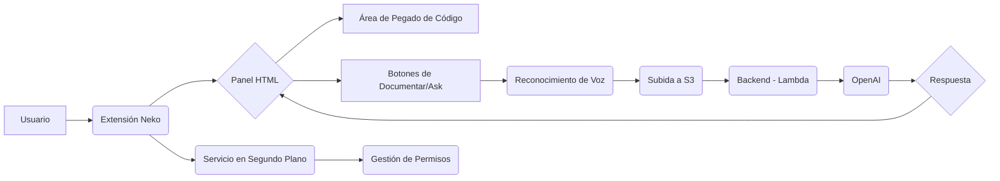

📄 Descripción general del proyecto
*   Nombre del código: Neko
*   Versión: 1.3
*   Explicación general: Extensión de navegador diseñada para facilitar la documentación de código y la búsqueda de información mediante la voz. Permite documentar código hablando y realizar preguntas para encontrar información relevante.
*   Qué problema resuelve el código: Reduce la tediosidad de la documentación manual, permitiendo una documentación más rápida y accesible a través de la entrada de voz.

⚙️ Visión general del sistema



*   Tecnologías utilizadas:
    *   JavaScript
    *   HTML
    *   CSS
    *   AWS SDK
    *   API de reconocimiento de voz de navegador
    *   AWS S3
    *   AWS Lambda
    *   OpenAI
*   Dependencias:
    *   aws-sdk.min.js
*   Requisitos del sistema:
    *   Navegador compatible con extensiones (Chrome, Edge, etc.)
    *   Acceso a micrófono
    *   Conexión a Internet
*   Prerrequisitos:
    *   Cuenta de AWS configurada con Cognito Identity Pool y permisos para acceder a S3.
    *   Clave de extensión secreta (X-EXTENSION-KEY).
    *   Cuenta en OpenAI y configuración de la API.

📦 Guía de uso

*   Cómo usarlo:
    1.  Instalar la extensión Neko en el navegador.
    2.  Abrir el panel de la extensión.
    3.  Pegar el código a documentar en el área de texto.
    4.  Hacer clic en el botón "Generate Documentation" para generar la documentación automáticamente.
    5.  Usar los botones "Start Recording" y "Stop Recording" en las secciones "Document" y "Ask" para grabar audio y realizar acciones de documentación o preguntas.
*   Explicación de los pasos (entrada, salida, parámetros):
    *   Entrada: Código fuente (texto), grabaciones de voz (audio).
    *   Salida: Documentación generada (texto en formato Markdown), respuestas a preguntas (texto).
    *   Parámetros: Idioma de reconocimiento de voz (configurado automáticamente según la configuración del navegador).
*   Caso de uso de ejemplo:

```javascript
// Ejemplo: Documentar una función simple
// 1. Abrir el panel de la extensión Neko.
// 2. Pegar el siguiente código en el área de texto:
function sumar(a, b) {
  return a + b;
}
// 3. Hacer clic en "Generate Documentation".
// 4. La extensión genera la documentación Markdown de la función.

// Ejemplo: Preguntar sobre el código documentado
// 1. Despues de documentar el codigo.
// 2. Click en "Ask", dar permisos al microfono.
// 3. Preguntar: "Qué hace la función sumar?".
// 4. La extensión muestra la respuesta generada por OpenAI.
```

🔐 Documentación de la API

*   Endpoints:
    *   `https://backend-extension-397605286686.us-central1.run.app` (Cloud Function para generar documentación).
    *   `https://3zjuc0gp83.execute-api.us-east-1.amazonaws.com/prod/document-prod-openai` (API Gateway para OpenAI).
*   Formatos de solicitud y respuesta:
    *   Cloud Function:
        *   Solicitud: `POST` con `Content-Type: application/json` y cuerpo `{ code: string }`.
        *   Respuesta: Texto Markdown con la documentación generada.
    *   API Gateway:
        *   Solicitud: `POST` con `Content-Type: application/json` y cuerpo `{ documentationText: string, userQuestion: string, language: string }`.
        *   Respuesta: JSON con la respuesta en `data.answer`.
*   Autenticación y autorización:
    *   Cloud Function: Requiere el header `X-EXTENSION-KEY: secret-key-01-12A`.
    *   API Gateway: No especifica autenticación en el código proporcionado.

📚 Referencias

*   [AWS SDK for JavaScript](https://aws.amazon.com/sdk-for-javascript/)
*   [Web Speech API](https://developer.mozilla.org/en-US/docs/Web/API/Web_Speech_API)
*   [Markdown](https://www.markdownguide.org/)
*   [Mermaid.js](https://mermaid-js.github.io/mermaid/#/)
*   [Cognito Identity Pools](https://docs.aws.amazon.com/cognito/latest/developerguide/cognito-identity.html)
*   [API Gateway](https://aws.amazon.com/api-gateway/)
*   [AWS Lambda](https://aws.amazon.com/lambda/)
*   [OpenAI API](https://openai.com/api/)
