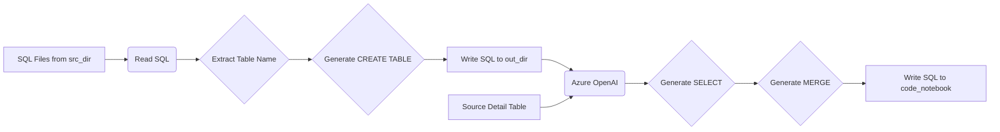

## 📄 Descripción general del proyecto

-   **Nombre del código:** nb\_CodeGenSilverBaseTables\_slv
-   **Versión:** N/A (Implícito en el código del notebook)
-   **Explicación general:** El código genera scripts SQL para crear tablas Silver en un data lake, utilizando Azure OpenAI para generar sentencias SELECT y MERGE. Primero, crea tablas vacías basadas en la estructura de las vistas Silver existentes. Luego, genera vistas temporales y sentencias MERGE para poblar estas tablas Silver desde tablas Bronze, utilizando Azure OpenAI para automatizar la creación del código SQL.
-   **Qué problema resuelve el código:** Automatiza la creación de tablas Silver y la lógica de integración de datos desde las tablas Bronze, reduciendo el esfuerzo manual y el riesgo de errores en la creación de scripts SQL.

## ⚙️ Visión general del sistema



-   **Tecnologías utilizadas:**
    *   Python
    *   PySpark
    *   Azure OpenAI
    *   Azure Synapse Analytics
    *   Fabric
-   **Dependencias:**
    *   `notebookutils`
    *   `pathlib`
    *   `pandas`
    *   `collections`
    *   `openai`
    *   `com.microsoft.spark.fabric`
    *   `pyspark.sql`
-   **Requisitos del sistema:**
    *   Acceso a un entorno Spark (Azure Synapse Analytics o Fabric)
    *   Acceso a Azure OpenAI
    *   Acceso a Azure Key Vault
-   **Prerrequisitos:**
    *   Configuración de las credenciales de Azure OpenAI en Azure Key Vault.
    *   Existencia de tablas Bronze en el data lake.
    *   Existencia de vistas Silver con la lógica de transformación deseada.
    *   Configuración de la tabla `wh_tolmar_job_control.job_control.source_detail` en Synapse SQL.

## 📦 Guía de uso

### Cómo usarlo

El código se ejecuta en un notebook de Fabric. Se configura con rutas de directorios de origen y destino, y utiliza Azure OpenAI para generar código SQL.

### Explicación de los pasos

1.  **Configuración inicial:**
    *   Define las rutas de los directorios de origen (`src_dir`) y destino (`out_dir`, `code_notebook`).
    *   Define el nombre de la fuente (`source`).
    *   Obtiene el token de acceso a Azure OpenAI desde Azure Key Vault.
2.  **Generación de sentencias `CREATE TABLE`:**
    *   Lee los archivos SQL de las vistas Silver desde el directorio de origen.
    *   Extrae el nombre de la tabla.
    *   Elimina comentarios y la definición de la vista del código SQL.
    *   Inyecta una columna surrogate key y columnas de auditoría.
    *   Crea una sentencia `CREATE TABLE` basada en la estructura de la vista.
    *   Guarda la sentencia `CREATE TABLE` en un archivo SQL en el directorio de destino.
3.  **Generación de sentencias `SELECT` y `MERGE` con Azure OpenAI:**
    *   Lee los archivos SQL de las vistas Silver desde el directorio de origen.
    *   Extrae el nombre de la tabla y el nombre de la tabla Bronze de origen.
    *   Construye un prompt para Azure OpenAI para generar una sentencia `SELECT` que crea una vista temporal.
    *   Construye un prompt para Azure OpenAI para generar una sentencia `MERGE` que inserta o actualiza datos en la tabla Silver.
    *   Guarda las sentencias `SELECT` y `MERGE` en un archivo de texto en el directorio de destino.

### Caso de uso de ejemplo

```python
from notebookutils import mssparkutils
import re

# Configuración (simulada)
src_dir = "Files/TOLMAR_FILES/silver"
out_dir = "Files/DDL_SLV"
source = "example_view"

# Simulando la lectura de un archivo SQL
sql_content = """
-- Ejemplo de vista Silver
CREATE VIEW example_view_slv AS
SELECT
    column1,
    column2
FROM
    lh_tolmar_DataHub_brn.example_table
WHERE
    condition = 'value';
"""

# Simulación de funciones mssparkutils.fs
class MockMSSparkUtilsFS:
    def put(self, path, content, overwrite=True):
        print(f"Simulando escritura en {path}:\n{content}")

mssparkutils.fs = MockMSSparkUtilsFS()

# Patrones (reutilizando los del código original)
comment_pat = re.compile(r'--.*$', re.MULTILINE)
view_pat = re.compile(r'^\s*CREATE\s+(?:OR\s+ALTER\s+)?VIEW\s+\S+\s+AS\s*', re.IGNORECASE | re.MULTILINE)
select_pat = re.compile(r'^\s*SELECT\b', re.IGNORECASE)
from_pat = re.compile(r'\bFROM\s+([A-Za-z0-9_]+)', re.IGNORECASE)

# Procesamiento del contenido SQL
sql = comment_pat.sub("", sql_content)
sql = sql.replace("lh_tolmar_DataHub_brn.", "")
sql = sql.replace("dbo.", "")
sql = re.sub(r'\[([^\]]+)\]', r'\1', sql)

table = source  # Nombre de la tabla
body = view_pat.sub("", sql).lstrip()
body = from_pat.sub(lambda m: f"FROM lh_tolmar_DataHub_brn.{m.group(1)}", body, count=1)
sk_line = f"CAST(NULL AS VARCHAR(55)) AS {table}_surrogate_key,"
body = select_pat.sub(lambda m: m.group(0) + "\n" + sk_line, body, count=1)
audit_blk = ("audit_insert_timestamp AS audit_insert_timestamp,\n"
             "audit_update_timestamp AS audit_update_timestamp,\n"
             "audit_insert_by AS audit_insert_by,\n"
             "audit_update_by AS audit_update_by,\n"
             "tac_batch_id AS tac_batch_id,\n"
             "is_delete AS is_delete")
body = re.sub(r'(?<=\S)(?=\s*FROM)', ",\n" + audit_blk + "\n", body, count=1)
body = body.rstrip().rstrip(';')
ddl = (f"CREATE TABLE lh_tolmar_DataHub_slv.{table} AS\n"
       f"{body}\n"
       "WHERE 1=0;")
ddl = re.sub(r'\n\s*\n+', '\n', ddl).strip() + '\n'

# Escritura simulada del resultado
out_path = f"{out_dir}/create_{table}.sql"
mssparkutils.fs.put(out_path, ddl, overwrite=True)
```

## 🔐 Documentación de la API

N/A. El código utiliza la API de Azure OpenAI, pero no expone una API propia.

## 📚 Referencias

*   **Azure OpenAI Service:** [https://learn.microsoft.com/en-us/azure/cognitive-services/openai/overview](https://learn.microsoft.com/en-us/azure/cognitive-services/openai/overview)
*   **PySpark SQL:** [https://spark.apache.org/docs/latest/sql-programming-guide.html](https://spark.apache.org/docs/latest/sql-programming-guide.html)
*   **Regular Expressions (Python):** [https://docs.python.org/3/library/re.html](https://docs.python.org/3/library/re.html)
*   **Fabric:** [https://www.microsoft.com/en-us/microsoft-fabric](https://www.microsoft.com/en-us/microsoft-fabric)
