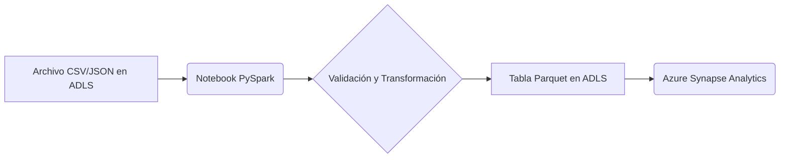

### 1. 📄 Descripción general del proyecto
- **Nombre del código:** NTB_Gen_Write_CSV_to_Datalake
- **Versión:** No especificada
- **Explicación general:** Este código es un notebook de PySpark diseñado para leer archivos CSV o JSON desde un Data Lake Storage (ADLS), realizar transformaciones y escribir los datos en una tabla particionada en el Data Lake. Incluye funcionalidades para el manejo de esquemas, encriptación de columnas y optimización de particiones.
- **Qué problema resuelve el código:** Automatiza el proceso de ingestión de datos desde archivos CSV o JSON a tablas particionadas en un Data Lake, manejando la variabilidad en los esquemas, la necesidad de encriptación y la optimización del almacenamiento.

### 2. ⚙️ Visión general del sistema
- **Arquitectura del sistema:**

- **Tecnologías utilizadas:**
  - PySpark
  - Azure Data Lake Storage (ADLS)
  - Azure Synapse Analytics
  - `mssparkutils`
  - `cryptography`
- **Dependencias:**
  - `pyspark`
  - `ast`
  - `json`
  - `datetime`
  - `math`
  - `re`
  - `uuid`
  - `cryptography`
- **Requisitos del sistema:**
  - Un entorno de Synapse Analytics Workspace configurado con un pool de Spark.
  - Acceso a una cuenta de Azure Data Lake Storage.
  - Permisos adecuados para leer y escribir en el Data Lake.
- **Prerrequisitos:**
  - Configuración de un pool de Spark en Azure Synapse Analytics.
  - Configuración de las credenciales de acceso a Azure Data Lake Storage.
  - Instalación de las bibliotecas de Python necesarias (`pyspark`, `cryptography`).
  - Existencia de un Key Vault para almacenar la clave de encriptación (si se utiliza la funcionalidad de encriptación).

### 3. 📦 Guía de uso
- **Cómo usarlo:** El notebook se ejecuta en un entorno de Azure Synapse Analytics. Los parámetros de configuración se pasan como un diccionario JSON a través de la variable `notebook_params`.
- **Explicación de los pasos (entrada, salida, parámetros):**
  - **Entrada:** Archivos CSV o JSON ubicados en Azure Data Lake Storage.
  - **Salida:** Tablas Parquet particionadas en Azure Data Lake Storage.
  - **Parámetros:**
    - `notebook_params` (JSON string): Contiene los siguientes parámetros:
      - `read_args` (dict): Parámetros para la lectura de los archivos (ej: `sep`, `header`, `inferSchema`, `multiline`).
      - `table_params` (dict): Parámetros relacionados con la tabla de destino (ej: `database_name`, `table_name`, `business_date`, `business_date_fmt`, `encrypt_columns`, `flatten`).
      - `params` (dict): Parámetros relacionados con el entorno (ej: `table_name_prefix`, `account_name`, `container_name`, `file_type`, `country`, `file_path`, `process_date`, `optimize`).
- **Caso de uso de ejemplo:**
```python
from pyspark.sql import SparkSession
from pyspark.sql.functions import lit
import json

# Inicializar SparkSession
spark = SparkSession.builder.appName("EjemploEscrituraDatalake").getOrCreate()

# Definir los parámetros
database_name = "mi_basededatos"
table_name = "mi_tabla"
container_name = "mi_contenedor"
account_name = "mi_cuenta_adls"
file_path = "/ruta/a/mi/archivo.csv"
process_date = "20240120"

# Crear un DataFrame de ejemplo
data = [("1", "Juan", "Perez"), ("2", "Maria", "Gomez")]
df = spark.createDataFrame(data, ["id", "nombre", "apellido"])

# Agregar columnas de auditoría
df = df.withColumn("processdate", lit(process_date))
df = df.withColumn("businessdate", lit(process_date))

# Ruta de destino en ADLS
output_path = f"abfss://{container_name}@{account_name}.dfs.core.windows.net/datalake/{database_name}/{table_name}"

# Escribir el DataFrame como tabla Parquet particionada
df.write.mode("overwrite").partitionBy("processdate", "businessdate").parquet(output_path)

print(f"Tabla {table_name} escrita exitosamente en {output_path}")

# Detener SparkSession
spark.stop()
```

### 5. 📚 Referencias
- Documentación de PySpark: https://spark.apache.org/docs/latest/api/python/index.html
- Documentación de Azure Synapse Analytics: https://learn.microsoft.com/en-us/azure/synapse-analytics/
- Documentación de Azure Data Lake Storage: https://learn.microsoft.com/en-us/azure/storage/blobs/data-lake-storage-introduction
