## 📄 Descripción general del proyecto

- **Nombre del código:** NTB_Gen_Write_CSV_to_Datalake
- **Versión:** No especificada (basado en las notas de la versión, la última es del 2023-09-28)
- **Explicación general:** Este código es un notebook de Synapse Analytics diseñado para leer archivos CSV o JSON desde Azure Data Lake Storage (ADLS), realizar transformaciones y escribir los datos en una tabla particionada en el mismo Data Lake.
- **Qué problema resuelve el código:** Automatiza el proceso de ingestión de datos desde archivos CSV/JSON a tablas de datos en un data lake, manejando la creación de tablas, el particionamiento, la encriptación de datos y la optimización del tamaño de las particiones.

## ⚙️ Visión general del sistema

```mermaid
graph LR
A[Inicio del Notebook] --> B(Parámetros de Notebook);
B --> C{¿Existe la tabla?};
C -- No --> D[Crear tabla externa];
C -- Sí --> E[Gestionar particiones duplicadas];
E --> F[Insertar datos en la tabla];
D --> F;
F --> G{¿Optimizar?};
G -- Sí --> H[Reconstruir particiones];
G -- No --> I[Conteo de filas];
H --> I;
I --> J{¿Encriptar?};
J -- Sí --> K[Eliminar archivos temporales];
J -- No --> L[Finalizar Notebook];
K --> L;
```



- **Tecnologías utilizadas:**
  - PySpark
  - Azure Synapse Analytics
  - Azure Data Lake Storage (ADLS)
  - `mssparkutils`
  - `cryptography` (para encriptación)
- **Dependencias:**
  - `pyspark`
  - `mssparkutils`
  - `ast`
  - `json`
  - `datetime`
  - `math`
  - `re`
  - `uuid`
  - `cryptography`
- **Requisitos del sistema:**
  - Azure Synapse Analytics Workspace
  - Azure Data Lake Storage Gen2 account
  - Spark Pool configurado en Synapse
  - Permisos adecuados para acceder a ADLS y Synapse
- **Prerrequisitos:**
  - Configuración de un Spark Pool en Azure Synapse Analytics.
  - Existencia de una cuenta de Azure Data Lake Storage Gen2.
  - Configuración de permisos de acceso a la cuenta de almacenamiento desde Synapse.
  - (Opcional) Configuración de Azure Key Vault para la gestión de claves de encriptación.

## 📦 Guía de uso

- **Cómo usarlo:** El notebook se ejecuta en un entorno de Azure Synapse Analytics. Se configura mediante un diccionario de parámetros JSON (`notebook_params`). Este diccionario contiene parámetros para la lectura de archivos, la definición de la tabla de destino y la configuración del entorno.
- **Explicación de los pasos:**
  1.  **Configuración de parámetros:** Se define la variable `notebook_params` en formato JSON. Esta variable contiene la configuración para la lectura de datos, la tabla de destino y otros parámetros del entorno.
  2.  **Lectura de archivos:** Se leen los archivos CSV o JSON desde la ruta especificada en ADLS, utilizando las opciones definidas en `read_args`.
  3.  **Transformación de datos:** Se realizan transformaciones en los datos, como la conversión de tipos de datos, el renombrado de columnas y la adición de columnas de auditoría (`processdate`, `businessdate`, `filename`).
  4.  **Escritura de datos:** Se escriben los datos transformados en una tabla particionada en ADLS. Si la tabla no existe, se crea. Si existe, se gestionan las particiones duplicadas antes de insertar los nuevos datos.
  5.  **Optimización (opcional):** Se optimiza el tamaño de las particiones para mejorar el rendimiento de las consultas.
  6.  **Encriptación (opcional):** Se encriptan columnas específicas utilizando una clave almacenada en Azure Key Vault.
- **Caso de uso de ejemplo:**

```python
from pyspark.sql import SparkSession

# Inicializar SparkSession
spark = SparkSession.builder.appName("EjemploEscrituraDatalake").getOrCreate()

# Definir parámetros (simulando notebook_params)
params = {
    "notebook_parameters": {
        "table_params": {
            "database_name": "ejemplo_db",
            "table_name": "ejemplo_tabla",
            "business_date": "fecha_columna",
            "business_date_fmt": "yyyy-MM-dd"
        },
        "params": {
            "table_name_prefix": "prefijo",
            "account_name": "mi_cuenta_adls",
            "container_name": "mi_contenedor",
            "file_type": "csv",
            "country": "mx",
            "file_path": "/ruta/a/los/archivos"
        },
        "read_args": {
            "sep": ",",
            "header": True,
            "inferSchema": True
        }
    }
}

# Crear un DataFrame de ejemplo
data = [("2023-01-01", "valor1"), ("2023-01-02", "valor2")]
df = spark.createDataFrame(data, ["fecha_columna", "valor"])

# Simular la escritura en el Data Lake (adaptar con la lógica del notebook)
# En un caso real, se usaría la lógica del notebook para escribir el DataFrame
# en la tabla particionada en ADLS.
df.write.partitionBy("fecha_columna").mode("append").parquet("abfss://mi_contenedor@mi_cuenta_adls.dfs.core.windows.net/ruta/a/la/tabla")

spark.stop()
```

## 🔐 Documentación de la API

Este código no expone una API tradicional. Es un notebook diseñado para ser ejecutado dentro de un entorno de Azure Synapse Analytics. La "API" en este contexto se refiere a la forma en que se configura y se interactúa con el notebook a través de sus parámetros.

- **Parámetros de entrada (notebook_params):**
  - `table_params`: Diccionario que define las propiedades de la tabla de destino.
    - `database_name`: Nombre de la base de datos en el metastore de Spark.
    - `table_name`: Nombre de la tabla de destino.
    - `business_date`: Nombre de la columna que contiene la fecha de negocio.
    - `business_date_fmt`: Formato de la columna `business_date`.
    - `force_field_type`: Permite forzar el tipo de datos de un campo.
    - `force_field_name`: Permite forzar el nombre de las columnas.
    - `force_schema`: Permite forzar el schema de la tabla.
    - `encrypt_columns`: Lista de columnas que deben ser encriptadas.
  - `params`: Diccionario que define los parámetros del entorno.
    - `table_name_prefix`: Prefijo para el nombre de la tabla.
    - `account_name`: Nombre de la cuenta de Azure Data Lake Storage.
    - `container_name`: Nombre del contenedor en ADLS.
    - `file_type`: Tipo de archivo de origen (`csv` o `json`).
    - `country`: Código del país.
    - `file_path`: Ruta al archivo o directorio de archivos en ADLS.
    - `process_date`: Fecha de proceso.
    - `optimize`: Indica si se debe optimizar el tamaño de las particiones.
  - `read_args`: Diccionario que define las opciones de lectura de archivos.
    - `sep`: Separador de columnas (para archivos CSV).
    - `header`: Indica si el archivo CSV tiene una fila de encabezado.
    - `inferSchema`: Indica si se debe inferir el esquema de los datos.
    - `multiline`: Indica si los registros pueden abarcar varias líneas.
- **Formato de respuesta:**
  - El notebook devuelve un diccionario JSON con el estado de la ejecución y un mensaje.
    - `status`: `success` o `error`.
    - `message`: Mensaje descriptivo del resultado de la ejecución.
- **Autenticación y autorización:**
  - El notebook utiliza la identidad administrada del workspace de Synapse para autenticarse con Azure Data Lake Storage. Se deben configurar los permisos adecuados en la cuenta de almacenamiento para que el workspace pueda leer los archivos de origen y escribir en la tabla de destino.
  - Si se utiliza la encriptación, se requiere acceso a Azure Key Vault para recuperar la clave de encriptación.

## 📚 Referencias

-   **Azure Synapse Analytics:** [https://azure.microsoft.com/en-us/services/synapse-analytics/](https://azure.microsoft.com/en-us/services/synapse-analytics/)
-   **Azure Data Lake Storage Gen2:** [https://azure.microsoft.com/en-us/services/storage/data-lake-storage/](https://azure.microsoft.com/en-us/services/storage/data-lake-storage/)
-   **PySpark:** [https://spark.apache.org/docs/latest/api/python/](https://spark.apache.org/docs/latest/api/python/)
-   **mssparkutils:** [https://docs.microsoft.com/en-us/azure/synapse-analytics/spark/microsoft-spark-utilities](https://docs.microsoft.com/en-us/azure/synapse-analytics/spark/microsoft-spark-utilities)
-   **cryptography:** [https://cryptography.io/en/latest/](https://cryptography.io/en/latest/)
-   **Fernet:** [https://cryptography.io/en/latest/fernet/](https://cryptography.io/en/latest/fernet/)
-   **Azure Key Vault:** [https://azure.microsoft.com/en-us/services/key-vault/](https://azure.microsoft.com/en-us/services/key-vault/)
