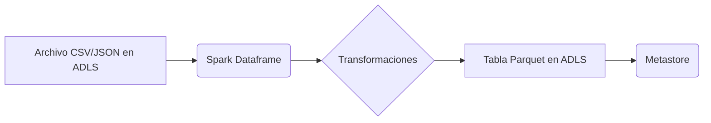

📄 Descripción general del proyecto
Nombre del código: NTB_Gen_Write_CSV_to_Datalake
Versión: No especificada (consultar notas de la versión dentro del código)
Explicación general: Este código es un notebook de PySpark diseñado para leer archivos CSV o JSON desde un Data Lake Storage (ADLS), transformar los datos y escribir los resultados en tablas particionadas en un Data Lake. Soporta la lectura de archivos, la definición de esquemas, el manejo de particiones, el cifrado de columnas y la optimización del almacenamiento.
Qué problema resuelve el código: Automatiza el proceso de ingestión de datos desde archivos CSV o JSON en un Data Lake, facilitando la creación y actualización de tablas particionadas con opciones de transformación y cifrado.

⚙️ Visión general del sistema
Arquitectura del sistema:

Tecnologías utilizadas:
- PySpark
- Azure Data Lake Storage (ADLS)
- Azure Synapse Analytics
- mssparkutils
- cryptography (Fernet)
Dependencias:
- pyspark
- Python cryptography library
- mssparkutils
Requisitos del sistema:
- Azure Synapse Analytics Workspace
- Azure Data Lake Storage Gen2 account
- Spark Pool configurado en Synapse
- Permisos adecuados para acceder al Data Lake
Prerrequisitos:
- Configuración de un Spark Pool en Azure Synapse Analytics.
- Acceso a una cuenta de Azure Data Lake Storage Gen2.
- Instalación de las librerías `pyspark`, `mssparkutils` y `cryptography`.
- Configuración de las credenciales de acceso al Data Lake.
- Configuración de un Key Vault con la clave de cifrado Fernet (si se usa el cifrado).

📦 Guía de uso
Cómo usarlo:
El notebook se ejecuta en un entorno de Azure Synapse Analytics Spark Pool. Recibe parámetros a través de la variable `notebook_params`, que contiene la configuración para la lectura de datos, la definición de la tabla de destino y los parámetros del entorno.
Explicación de los pasos:
1.  Entrada:
    - `notebook_params`: Un string JSON que contiene los parámetros de configuración. Este string se convierte en un diccionario de Python.
        - `table_params`: Parámetros relacionados con la tabla de destino.
            - `database_name`: Nombre de la base de datos en el metastore.
            - `table_name`: Nombre de la tabla.
            - `business_date`: Columna que representa la fecha de negocio.
            - `business_date_fmt`: Formato de la fecha de negocio.
            - `flatten`: Columna para aplanar JSON (opcional).
            - `encrypt_columns`: Lista de columnas a encriptar (opcional).
        - `params`: Parámetros relacionados con el entorno.
            - `table_name_prefix`: Prefijo para el nombre de la tabla.
            - `account_name`: Nombre de la cuenta de almacenamiento ADLS.
            - `container_name`: Nombre del contenedor en ADLS.
            - `file_type`: Tipo de archivo (`csv` o `json`).
            - `country`: País asociado a los datos.
            - `file_path`: Ruta al archivo en ADLS.
            - `process_date`: Fecha de procesamiento (opcional).
        - `read_args`: Argumentos para la lectura de archivos.
            - `sep`: Separador de columnas (para CSV).
            - `header`: Indica si el archivo tiene encabezado.
            - `inferSchema`: Indica si se debe inferir el esquema.
            - `multiline`: Indica si el archivo tiene múltiples líneas.
2.  Proceso:
    1.  Parseo de parámetros: El notebook parsea el string JSON de entrada en un diccionario de Python.
    2.  Lectura de datos: Lee los archivos CSV o JSON desde ADLS usando PySpark, aplicando las opciones de lectura especificadas en `read_args`.
    3.  Transformación de datos:
        - Agrega columnas `filename`, `processdate` y `businessdate`.
        - Cifra las columnas especificadas en `encrypt_columns` (si se proporciona).
    4.  Escritura de datos: Escribe los datos transformados en una tabla particionada en formato Parquet en ADLS.
        - Si la tabla no existe, la crea.
        - Si la tabla existe, elimina las particiones duplicadas y agrega las nuevas particiones.
    5.  Optimización (opcional): Reconstruye las particiones si el tamaño de los archivos excede un umbral.
    6.  Eliminación de archivos temporales: Elimina los archivos temporales utilizados para el cifrado (si se usó el cifrado).
3.  Salida:
    - El notebook devuelve un diccionario JSON con el estado (`status`) y un mensaje (`message`) indicando el resultado de la ejecución.
        - `status`: `success` o `error`.
        - `message`: Mensaje descriptivo del resultado.
Caso de uso de ejemplo:
```python
notebook_params = """
{
    "notebook_parameters": {
        "table_params": {
            "database_name": "my_datalake",
            "table_name": "products",
            "business_date": "last_updated",
            "business_date_fmt": "yyyy-MM-dd",
            "encrypt_columns": ["product_name"]
        },
        "params": {
            "table_name_prefix": "retail",
            "account_name": "myadlsaccount",
            "container_name": "raw",
            "file_type": "csv",
            "country": "usa",
            "file_path": "/products_data",
            "process_date": "20240129"
        },
        "read_args": {
            "sep": ",",
            "header": True,
            "inferSchema": True
        }
    }
}
"""
# En un entorno Synapse, este código se ejecutaría dentro de un notebook
# y la variable notebook_params se pasaría como parámetro al notebook.
# El notebook procesaría los datos y los escribiría en el Data Lake.
```

🔐 Documentación de la API
No aplica.

📚 Referencias
- PySpark: [https://spark.apache.org/docs/latest/api/python/](https://spark.apache.org/docs/latest/api/python/)
- Azure Data Lake Storage Gen2: [https://docs.microsoft.com/en-us/azure/storage/blobs/data-lake-storage-introduction](https://docs.microsoft.com/en-us/azure/storage/blobs/data-lake-storage-introduction)
- mssparkutils: [https://docs.microsoft.com/en-us/azure/synapse-analytics/spark/microsoft-spark-utilities](https://docs.microsoft.com/en-us/azure/synapse-analytics/spark/microsoft-spark-utilities)
- Fernet encryption: [https://cryptography.io/en/latest/fernet/](https://cryptography.io/en/latest/fernet/)
- Apache Parquet: [https://parquet.apache.org/](https://parquet.apache.org/)
