## 📄 Descripción general del proyecto

*   **Nombre del código:** learner.py
*   **Versión:** N/A
*   **Explicación general:** Este código implementa varias estrategias de aprendizaje continuo (Continual Learning) y "fine-tuning" básico. Incluye tres estrategias principales: Fine-tune (naïve), Replay y Elastic Weight Consolidation (EWC).
*   **Qué problema resuelve el código:** Aborda el problema del olvido catastrófico en modelos de aprendizaje automático cuando se entrenan secuencialmente en diferentes tareas.

## ⚙️ Visión general del sistema

*   **Arquitectura del sistema:**

```mermaid
graph LR
    A[Entrada: Datos] --> B(Learner);
    B --> C{Modelo};
    C --> D[Salida: Predicciones];
    E[Buffer] --> B;
    F[Pérdida] --> B;
    style B fill:#f9f,stroke:#333,stroke-width:2px
```



*   **Tecnologías utilizadas:**
    *   Python
    *   PyTorch
*   **Dependencias:**
    *   torch
    *   torch.nn
    *   torch.optim
    *   torch.utils.data
    *   argparse
    *   random
    *   collections
    *   typing
*   **Requisitos del sistema:**
    *   Python 3.7+
    *   PyTorch instalado
*   **Prerrequisitos:**
    *   Conocimiento básico de PyTorch y aprendizaje automático.
    *   Entender los conceptos de aprendizaje continuo y olvido catastrófico.

## 📦 Guía de uso

*   **Cómo usarlo:** El script `learner.py` define diferentes estrategias de aprendizaje continuo que se pueden usar para entrenar un modelo en una secuencia de tareas. Se puede ejecutar directamente para realizar una prueba rápida (smoke test) de las estrategias implementadas.
*   **Explicación de los pasos:**
    1.  **Entrada:** El código recibe como entrada un modelo de PyTorch, datos de entrenamiento divididos en tareas, y parámetros específicos de cada estrategia (e.g., tamaño del buffer para Replay, lambda para EWC).
    2.  **Salida:** Durante el entrenamiento, el código produce la pérdida (loss) en cada lote de datos. Al final del entrenamiento, se puede evaluar el rendimiento del modelo en cada tarea.
    3.  **Parámetros:**
        *   `strategy`: Especifica la estrategia de aprendizaje continuo a utilizar (finetune, replay, ewc).
        *   `model`: El modelo de red neuronal a entrenar.
        *   `lr`: Tasa de aprendizaje (learning rate) para el optimizador.
        *   `buffer_size`: Tamaño del buffer de memoria para la estrategia Replay.
        *   `ewc_lambda`: Coeficiente de regularización para la estrategia EWC.
*   **Caso de uso de ejemplo:**

```python
import torch
import torch.nn as nn
from learner import build_learner

# Definir un modelo simple
class SimpleModel(nn.Module):
    def __init__(self, input_size, output_size):
        super().__init__()
        self.linear = nn.Linear(input_size, output_size)

    def forward(self, x):
        return self.linear(x)

# Crear datos de ejemplo
input_size = 10
output_size = 2
model = SimpleModel(input_size, output_size)

# Crear un learner EWC
learner = build_learner(strategy="ewc", model=model, ewc_lambda=0.5)

# Datos de ejemplo (un solo batch)
x = torch.randn(32, input_size)
y = torch.randint(0, output_size, (32,))
batch = (x, y)

# Simular un paso de entrenamiento
loss = learner.observe(batch)
print(f"Loss: {loss}")

# Simular el final de la tarea (requiere un dataloader)
from torch.utils.data import DataLoader, TensorDataset
dataset = TensorDataset(x, y)
dataloader = DataLoader(dataset, batch_size=32)
learner.end_task(dataloader)
```

## 🔐 Documentación de la API

*   **Endpoints:** No aplica, ya que este código no define una API.
*   **Formatos de solicitud y respuesta:** No aplica.
*   **Autenticación y autorización:** No aplica.

## 📚 Referencias

*   **Reservoir Sampling:** [https://en.wikipedia.org/wiki/Reservoir_sampling](https://en.wikipedia.org/wiki/Reservoir_sampling)
*   **Elastic Weight Consolidation (EWC):** Kirkpatrick, J., Pascanu, R.,  et al. (2017). Overcoming catastrophic forgetting in neural networks. *Proceedings of the National Academy of Sciences*, *114*(13), 3521-3526.
    [https://www.pnas.org/doi/full/10.1073/pnas.1611835114](https://www.pnas.org/doi/full/10.1073/pnas.1611835114)
*   **PyTorch:** [https://pytorch.org/](https://pytorch.org/)
