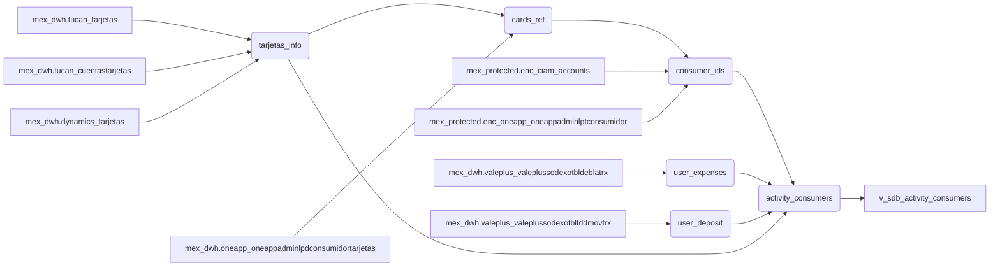

### 📄 Descripción general del proyecto

*   **Nombre del código:** `v_sdb_activity_consumers`
*   **Versión:** N/A
*   **Explicación general:** Esta vista SQL está diseñada para calcular métricas relacionadas con la actividad de los consumidores en el contexto del proyecto Sendinblue, utilizando tablas del Data Warehouse (DWH) de México (MEX). Se enfoca en actividades relacionadas con tarjetas Sodexo.
*   **Qué problema resuelve el código:** Facilita la extracción y transformación de datos relevantes sobre el uso de tarjetas Sodexo por parte de los consumidores, consolidando información de diversas tablas del DWH en un formato adecuado para análisis y reporting.

### ⚙️ Visión general del sistema

*   **Arquitectura del sistema:**



*   **Tecnologías utilizadas:**
    *   SQL (Transact-SQL)
*   **Dependencias:**
    *   `mex_dwh.tucan_tarjetas`
    *   `mex_dwh.tucan_cuentastarjetas`
    *   `mex_dwh.dynamics_tarjetas`
    *   `mex_dwh.oneapp_oneappadminlpdconsumidortarjetas`
    *   `mex_protected.enc_ciam_accounts`
    *   `mex_protected.enc_oneapp_oneappadminlptconsumidor`
    *   `mex_dwh.valeplus_valeplussodexotbldeblatrx`
    *   `mex_dwh.valeplus_valeplussodexotbltddmovtrx`
*   **Requisitos del sistema:**
    *   Acceso a las bases de datos y tablas mencionadas en las dependencias.
    *   Permisos para crear vistas en la base de datos `mex_dwh`.
    *   Funciones de desencriptación configuradas y accesibles (`DecryptByKey`).
*   **Prerrequisitos:**
    *   Las tablas dependientes deben existir y contener datos relevantes.
    *   Las claves de desencriptación deben estar configuradas correctamente para acceder a los datos protegidos.

### 📦 Guía de uso

*   **Cómo usarlo:** La vista `mex_dwh.v_sdb_activity_consumers` se utiliza como cualquier otra vista SQL. Se puede consultar directamente para obtener las métricas calculadas.
*   **Explicación de los pasos:**
    1.  La vista consolida información de varias tablas DWH relacionadas con tarjetas y consumidores.
    2.  Calcula métricas como la fecha del último gasto, el número de compras en los últimos 3 meses y el importe gastado.
    3.  Transforma los datos utilizando `UNPIVOT` para generar filas con nombres de métricas y sus valores correspondientes.
    4.  Crea un hashkey para cada registro combinando el ID del consumidor, un valor nulo y el nombre de la métrica del producto.
*   **Caso de uso de ejemplo:**

```sql
-- Ejemplo de consulta para obtener el nombre del producto y el valor de la métrica para un SDX_CON_ID específico
SELECT PRODUCT_NAME, PRODUCT_METRIC_NAME, PRODUCT_METRIC_VALUE
FROM mex_dwh.v_sdb_activity_consumers
WHERE SDX_CON_ID = 'some_consumer_id';
```

### 🔐 Documentación de la API

Esta sección no aplica ya que el código proporcionado es una vista SQL, no una API.

### 📚 Referencias

*   **UNPIVOT Operator:** [https://learn.microsoft.com/en-us/sql/t-sql/queries/from-clause-transact-sql?view=sql-server-ver16](https://learn.microsoft.com/en-us/sql/t-sql/queries/from-clause-transact-sql?view=sql-server-ver16)
*   **HASHBYTES:** [https://learn.microsoft.com/en-us/sql/t-sql/functions/hashbytes-transact-sql?view=sql-server-ver16](https://learn.microsoft.com/en-us/sql/t-sql/functions/hashbytes-transact-sql?view=sql-server-ver16)
*   **DATEADD:** [https://learn.microsoft.com/en-us/sql/t-sql/functions/dateadd-transact-sql?view=sql-server-ver16](https://learn.microsoft.com/en-us/sql/t-sql/functions/dateadd-transact-sql?view=sql-server-ver16)
*   **DecryptByKey:** [https://learn.microsoft.com/en-us/sql/t-sql/functions/decryptbykey-transact-sql?view=sql-server-ver16](https://learn.microsoft.com/en-us/sql/t-sql/functions/decryptbykey-transact-sql?view=sql-server-ver16)
