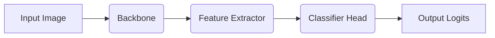

### 📄 Descripción general del proyecto
  - Nombre del código: models.py
  - Versión: N/A
  - Explicación general: Este script de Python define funciones y clases para construir modelos de aprendizaje continuo (Continual Learning), incluyendo backbones (ResNet-18/50, ViT-tiny/small) y clasificadores. Proporciona soporte multi-GPU y un "smoketest" para verificar la correcta funcionalidad del modelo.
  - Qué problema resuelve el código: Facilita la creación y configuración de modelos de redes neuronales para tareas de aprendizaje continuo, abstrayendo la complejidad de la inicialización de backbones populares y la adición de clasificadores.

### ⚙️ Visión general del sistema
  - Arquitectura del sistema:

  - Tecnologías utilizadas:
    - Python
    - PyTorch
    - Torchvision
    - Timm (opcional)
  - Dependencias:
    - torch
    - torchvision
    - timm (opcional)
  - Requisitos del sistema:
    - Python 3.7+
    - PyTorch instalado
    - (Opcional) Timm instalado para usar ViT y otros modelos.
  - Prerrequisitos:
    - Entorno Python configurado.
    - Instalación de las dependencias necesarias (torch, torchvision, timm).

### 📦 Guía de uso
  - Cómo usarlo:
    1. Importar las funciones y clases necesarias desde el módulo `models.py`.
    2. Utilizar la función `get_backbone` para obtener un modelo backbone preconfigurado (por ejemplo, ResNet-18 o ViT).
    3. Crear una instancia de la clase `Classifier`, pasando el backbone y el número de clases como argumentos.
    4. (Opcional) Utilizar la función `wrap_dataparallel` para habilitar el soporte multi-GPU.
    5. Pasar los datos de entrada al modelo para obtener las predicciones.
  - Explicación de los pasos:
    - **Entrada:** La función `get_backbone` recibe el nombre del backbone (`name`), un booleano que indica si se deben usar pesos preentrenados (`pretrained`), y argumentos adicionales (`**kw`). La clase `Classifier` recibe un modelo backbone y el número de clases.
    - **Salida:** La función `get_backbone` devuelve un modelo backbone de PyTorch. La clase `Classifier` devuelve un objeto que puede ser usado para realizar la clasificación.
    - **Parámetros:**
        - `name`: Nombre del backbone (ej: "resnet18", "vit_tiny").
        - `pretrained`: Booleano que indica si se deben usar pesos preentrenados.
        - `num_classes`: Número de clases para el clasificador.
  - Caso de uso de ejemplo:
```python
import torch
import torch.nn as nn
from models import get_backbone, Classifier

# Obtener un backbone ResNet-18 preentrenado
backbone = get_backbone(name="resnet18", pretrained=True)

# Crear un clasificador con 10 clases
classifier = Classifier(backbone, num_classes=10)

# Crear datos de entrada de ejemplo
input_data = torch.randn(1, 3, 224, 224)

# Pasar los datos a través del clasificador
output = classifier(input_data)

# Imprimir la forma de la salida
print(output.shape)  # Salida: torch.Size([1, 10])
```

### 🔐 Documentación de la API 
  - No aplica.

### 📚 Referencias
  - PyTorch: [https://pytorch.org/](https://pytorch.org/)
  - Torchvision: [https://pytorch.org/vision/stable/index.html](https://pytorch.org/vision/stable/index.html)
  - Timm: [https://github.com/rwightman/pytorch-image-models](https://github.com/rwightman/pytorch-image-models)
  - ResNet: [https://arxiv.org/abs/1512.03385](https://arxiv.org/abs/1512.03385)
  - Vision Transformer (ViT): [https://arxiv.org/abs/2010.11929](https://arxiv.org/abs/2010.11929)
  - DataParallel: [https://pytorch.org/docs/stable/generated/torch.nn.DataParallel.html](https://pytorch.org/docs/stable/generated/torch.nn.DataParallel.html)
