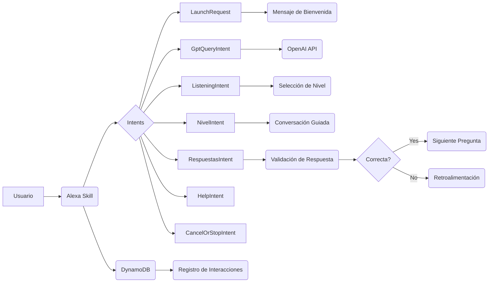

## 📄 Descripción general del proyecto

**Nombre del código:** Tutor de Idiomas

**Versión:** 1.0

**Explicación general:**
Este código implementa una skill de Alexa diseñada para ayudar a los usuarios a practicar y mejorar sus habilidades en español e inglés. La skill ofrece funcionalidades como conversaciones guiadas en diferentes niveles de dificultad, interacción con el modelo de lenguaje GPT para practicar la expresión oral, y seguimiento del progreso del usuario.

**Qué problema resuelve el código:**
El código resuelve el problema de proporcionar una plataforma interactiva y accesible para el aprendizaje y la práctica de idiomas, adaptada a las necesidades y al nivel de cada usuario. Facilita la práctica de la comprensión auditiva y la expresión oral, ofreciendo retroalimentación y seguimiento del progreso.

## ⚙️ Visión general del sistema

**Arquitectura del sistema:**



**Tecnologías utilizadas:**

*   Python
*   Alexa Skills Kit SDK
*   OpenAI API
*   Boto3 (AWS SDK for Python)
*   DynamoDB

**Dependencias:**

*   ask-sdk-core
*   ask-sdk-model
*   openai
*   json
*   unicodedata
*   requests
*   boto3
*   uuid
*   datetime

**Requisitos del sistema:**

*   Cuenta de Amazon Developer para crear la skill de Alexa.
*   Cuenta de OpenAI con una clave API válida.
*   Cuenta de AWS con acceso a DynamoDB.
*   Entorno de desarrollo de Python 3.6 o superior.

**Prerrequisitos:**

*   Tener instaladas las dependencias de Python listadas.
*   Configurar las credenciales de AWS para acceder a DynamoDB.
*   Guardar la clave API de OpenAI en un archivo `conf_credentials.json`.

## 📦 Guía de uso

**Cómo usarlo:**

1.  **Configuración inicial:**
    *   Asegúrate de tener todas las dependencias instaladas (`pip install -r requirements.txt`).
    *   Crea un archivo `conf_credentials.json` con tu clave API de OpenAI:

    ```json
    {
    "pwd": "TU_CLAVE_API_OPENAI"
    }
    ```
    *   Configura las credenciales de AWS para acceder a DynamoDB.
2.  **Implementación de la skill en Alexa Developer Console:**
    *   Crea una nueva skill en Alexa Developer Console.
    *   Copia el código de `lambda_function.py` en el editor de código de la función Lambda de tu skill.
    *   Configura los intents, slots y utterance samples en el interaction model de tu skill.
3.  **Interacción con la skill:**
    *   Invoca la skill en un dispositivo Alexa diciendo "Alexa, abre tutor de idiomas".
    *   Sigue las instrucciones de la skill para practicar la expresión oral o la comprensión auditiva.

**Explicación de los pasos (entrada, salida, parámetros):**

*   **LaunchRequest (Entrada):** El usuario invoca la skill.
    *   **Salida:** La skill saluda al usuario y le pregunta qué tema le gustaría discutir o si prefiere practicar la comprensión auditiva.
*   **GptQueryIntent (Entrada):** El usuario hace una pregunta o expresa un tema en español o inglés.
    *   **Parámetros:** `query` (texto de la pregunta o tema).
    *   **Salida:** La skill responde a la pregunta utilizando la API de OpenAI y hace una pregunta de seguimiento.
*   **ListeningIntent (Entrada):** El usuario indica que quiere practicar la comprensión auditiva.
    *   **Salida:** La skill pregunta al usuario en qué nivel le gustaría empezar (fácil, medio, difícil).
*   **NivelIntent (Entrada):** El usuario especifica el nivel de dificultad para la práctica de comprensión auditiva.
    *   **Parámetros:** `nivel` (fácil, medio, difícil).
    *   **Salida:** La skill inicia una conversación guiada en el nivel especificado.
*   **RespuestasIntent (Entrada):** El usuario responde a una pregunta durante la conversación guiada.
    *   **Parámetros:** `opcion` (a, b, c, d).
    *   **Salida:** La skill valida la respuesta, proporciona retroalimentación y continúa con la siguiente pregunta o finaliza la conversación.

**Caso de uso de ejemplo:**

```python
# Ejemplo de uso de la skill para practicar la expresión oral

# El usuario dice: "Alexa, abre tutor de idiomas"
# La skill responde: "Hola, soy tu tutor de idiomas. ¿Sobre qué tema te gustaría hablar para practicar tu expresión oral?"

# El usuario dice: "Alexa, quiero hablar sobre mis vacaciones"
# La skill envía la pregunta a la API de OpenAI y responde con una pregunta de seguimiento:
# "¡Qué interesante! ¿A dónde fuiste en tus vacaciones? ¿Qué fue lo que más te gustó?"
```

## 🔐 Documentación de la API

Esta skill utiliza la API de OpenAI para generar respuestas y mantener la conversación.

*   **Endpoint:** `https://api.openai.com/v1/chat/completions`
*   **Formato de solicitud:**

```json
{
  "model": "gpt-3.5-turbo",
  "messages": [
    {"role": "system", "content": "Tú eres el asistente y yo soy el usuario."},
    {"role": "user", "content": "Quiero mejorar mi inglés, así que conversemos en inglés..."}
  ]
}
```

*   **Formato de respuesta:**

```json
{
  "id": "chatcmpl-...",
  "object": "chat.completion",
  "created": 1678900000,
  "model": "gpt-3.5-turbo",
  "choices": [
    {
      "message": {
        "role": "assistant",
        "content": "Hello! That sounds great. What would you like to talk about today?"
      },
      "finish_reason": "stop",
      "index": 0
    }
  ],
  "usage": {
    "prompt_tokens": 50,
    "completion_tokens": 20,
    "total_tokens": 70
  }
}
```

*   **Autenticación y autorización:**
    *   La autenticación se realiza mediante una clave API que se proporciona en el encabezado de la solicitud HTTP.
    *   La autorización se basa en los permisos asociados a la clave API.

## 📚 Referencias

*   **Alexa Skills Kit SDK for Python:** [https://developer.amazon.com/en-US/docs/alexa/alexa-skills-kit-sdk-for-python/overview.html](https://developer.amazon.com/en-US/docs/alexa/alexa-skills-kit-sdk-for-python/overview.html)
*   **OpenAI API:** [https://platform.openai.com/docs/api-reference](https://platform.openai.com/docs/api-reference)
*   **Boto3 (AWS SDK for Python):** [https://boto3.amazonaws.com/v1/documentation/api/index.html](https://boto3.amazonaws.com/v1/documentation/api/index.html)
*   **DynamoDB:** [https://aws.amazon.com/dynamodb/](https://aws.amazon.com/dynamodb/)
*   **Utterance samples:** [https://developer.amazon.com/en-US/docs/alexa/custom-skills/define-synonyms-and-ids-for-slot-type-values.html](https://developer.amazon.com/en-US/docs/alexa/custom-skills/define-synonyms-and-ids-for-slot-type-values.html)
