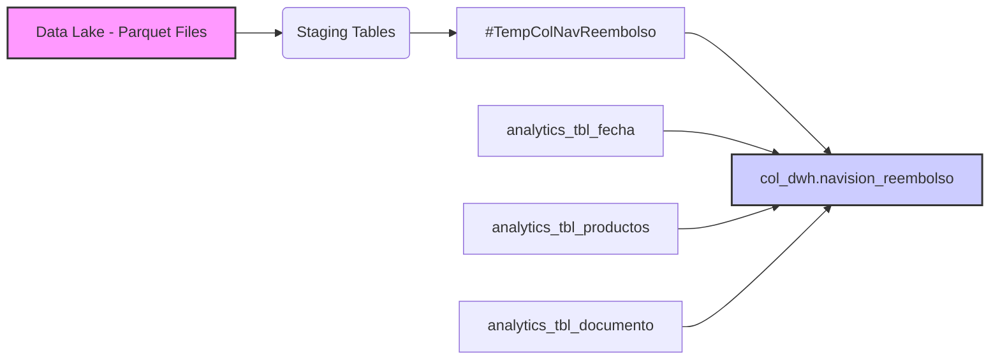

## 📄 Descripción general del proyecto

**Nombre del código:** `sp_navision_reembolso`
**Versión:** 1.0

**Explicación general:**
Este procedimiento almacenado (`sp_navision_reembolso`) está diseñado para extraer, transformar y cargar datos relacionados con reembolsos desde un Data Lake en formato Parquet hacia una tabla en un Data Warehouse. El procedimiento se enfoca en datos provenientes de Navision (Microsoft Dynamics NAV), específicamente información de clientes, entradas de contabilidad general y valores de dimensión.

**Qué problema resuelve el código:**
El código resuelve el problema de consolidar y transformar datos de reembolsos dispersos en diferentes tablas y formatos dentro de un Data Lake, facilitando el análisis y la generación de informes sobre estos reembolsos en un entorno de Data Warehouse.

## ⚙️ Visión general del sistema

**Arquitectura del sistema:**



**Tecnologías utilizadas:**
*   SQL Server
*   Azure Data Lake Storage
*   Parquet file format

**Dependencias:**
*   Acceso a Azure Data Lake Storage con permisos de Managed Identity.
*   Existencia de las tablas `col_dwh.analytics_tbl_fecha`, `col_dwh.analytics_tbl_productos` y `col_dwh.analytics_tbl_documento` en la base de datos.
*   Estructura de directorios en Azure Data Lake Storage con el formato especificado en el código (e.g., `finance/datalake/col/navision_tbl_customer/processdate=YYYYMMDD/*/*.parquet`).

**Requisitos del sistema:**
*   SQL Server 2016 o superior con PolyBase habilitado.
*   Acceso de red desde SQL Server al Azure Data Lake Storage.

**Prerrequisitos:**
*   Configurar una Managed Identity con permisos de lectura en Azure Data Lake Storage.
*   Crear las tablas temporales (#temp\_nav\_customer, #temp\_g\_l\_entry, #temp\_dimension\_value) con la estructura adecuada para recibir los datos desde los archivos Parquet.

## 📦 Guía de uso

**Cómo usarlo:**
El procedimiento almacenado se ejecuta en SQL Server. Recibe un parámetro `@PARAMS` de tipo VARCHAR(1000), aunque en la versión actual del código, este parámetro no se utiliza.

**Explicación de los pasos:**

1.  **Creación de la tabla destino (si no existe):** Verifica si la tabla `col_dwh.navision_reembolso` existe. Si no existe, la crea con la estructura especificada.
2.  **Creación de tablas temporales:** Crea tablas temporales para almacenar los datos extraídos de los archivos Parquet.
3.  **Carga de datos desde Azure Data Lake Storage:** Utiliza la instrucción `COPY INTO` para cargar datos desde los archivos Parquet en Azure Data Lake Storage a las tablas temporales. La fecha para la ruta de los archivos se obtiene dinámicamente con `GETDATE()`.
4.  **Transformación de datos:** Realiza una serie de transformaciones y uniones de datos desde las tablas temporales para preparar los datos para la inserción en la tabla destino. Esto incluye la conversión de tipos de datos, el cálculo de campos y la manipulación de cadenas.
5.  **Inserción de datos en la tabla destino:** Inserta los datos transformados en la tabla `col_dwh.navision_reembolso`.
6.  **Eliminación de tablas temporales:** Elimina las tablas temporales creadas durante el proceso.

**Caso de uso de ejemplo:**

```sql
-- Ejecutar el procedimiento almacenado
EXEC col_dwh.sp_navision_reembolso @PARAMS = '';

-- Verificar los resultados
SELECT TOP 10 * FROM col_dwh.navision_reembolso;
```

Este ejemplo muestra cómo ejecutar el procedimiento almacenado sin pasar ningún parámetro específico. Después de la ejecución, se realiza una consulta simple para verificar que los datos se hayan insertado correctamente en la tabla `col_dwh.navision_reembolso`.

## 🔐 Documentación de la API

Este procedimiento almacenado no expone endpoints directamente, ya que se ejecuta dentro de SQL Server. No aplica la documentación de API.

## 📚 Referencias

*   **COPY INTO (Transact-SQL):** [https://learn.microsoft.com/en-us/sql/t-sql/statements/copy-into-transact-sql?view=sql-server-ver16](https://learn.microsoft.com/en-us/sql/t-sql/statements/copy-into-transact-sql?view=sql-server-ver16)
*   **Azure Data Lake Storage:** [https://azure.microsoft.com/en-us/products/data-lake-storage](https://azure.microsoft.com/en-us/products/data-lake-storage)
*   **Parquet File Format:** [https://parquet.apache.org/](https://parquet.apache.org/)
*   **Managed Identities for Azure Resources:** [https://learn.microsoft.com/en-us/azure/active-directory/managed-identities-azure-resources/overview](https://learn.microsoft.com/en-us/azure/active-directory/managed-identities-azure-resources/overview)
