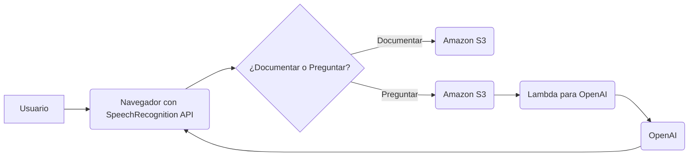

📄 **Descripción general del proyecto**

*   **Nombre del código:** Speech-to-Text Documentation Tool
*   **Versión:** 1.0
*   **Explicación general:** Este código implementa una herramienta de documentación basada en reconocimiento de voz. Permite a los usuarios grabar su voz, transcribirla a texto y guardar la transcripción en un bucket de Amazon S3. Además, ofrece la funcionalidad de realizar preguntas sobre la documentación existente, utilizando OpenAI para generar respuestas basadas en el contenido almacenado en S3.
*   **Qué problema resuelve el código:** Facilita la creación de documentación mediante la transcripción de voz a texto, eliminando la necesidad de escribir manualmente. También permite a los usuarios obtener respuestas rápidas a preguntas sobre la documentación existente, mejorando la accesibilidad y la eficiencia.

⚙️ **Visión general del sistema**

*   **Arquitectura del sistema:**



*   **Tecnologías utilizadas:**
    *   JavaScript
    *   HTML
    *   CSS (implícito en la manipulación del DOM)
    *   SpeechRecognition API (Web Speech API)
    *   Amazon S3
    *   AWS Cognito
    *   AWS Lambda
    *   OpenAI API
*   **Dependencias:**
    *   AWS SDK for JavaScript
    *   Acceso a la API de OpenAI (a través de una función Lambda)
*   **Requisitos del sistema:**
    *   Navegador web compatible con la SpeechRecognition API (Chrome, Edge, etc.)
    *   Conexión a Internet
    *   Cuenta de AWS con permisos para acceder a S3 y Cognito
    *   Cuenta de OpenAI con acceso a la API
*   **Prerrequisitos:**
    *   Configurar las credenciales de AWS en el entorno (Identity Pool ID de Cognito)
    *   Tener un bucket de S3 creado para almacenar las transcripciones
    *   Tener una función Lambda configurada para interactuar con la API de OpenAI

📦 **Guía de uso (Desarrollador)**

*   **Cómo usarlo:**
    1.  Incluir el código JavaScript en una página HTML con los elementos necesarios (botones de inicio/parada, área de salida de texto).
    2.  Configurar las credenciales de AWS y el nombre del bucket de S3.
    3.  Implementar la función Lambda para interactuar con la API de OpenAI.
*   **Explicación de los pasos:**
    1.  **Inicialización:**
        *   Verifica la compatibilidad del navegador con la SpeechRecognition API.
        *   Crea una instancia de `SpeechRecognition`.
        *   Detecta el idioma del usuario y configura el idioma de reconocimiento.
        *   Genera un `userId` único y lo almacena en `localStorage`.
        *   Genera un `sessionId` único y lo almacena en `sessionStorage`.
    2.  **Grabación:**
        *   Al hacer clic en el botón "Start", se inicia la grabación de voz.
        *   La transcripción se muestra en el área de salida de texto.
    3.  **Detención de la grabación:**
        *   Al hacer clic en el botón "Stop", se detiene la grabación.
        *   La transcripción se guarda en un archivo de texto en S3.
    4.  **Preguntas:**
        *   Al hacer clic en el botón "Ask Start", se inicia la grabación de voz para la pregunta.
        *   Al hacer clic en el botón "Ask Stop", se detiene la grabación.
        *   Se recupera la documentación existente de S3.
        *   Se envía la documentación y la pregunta a la función Lambda que interactúa con OpenAI.
        *   La respuesta de OpenAI se muestra en el área de salida de texto y se reproduce mediante Text-to-Speech.
    5.  **Eliminación de datos:**
        *   Al hacer clic en el icono de eliminar, se muestra una confirmación.
        *   Si se confirma, se eliminan todos los archivos de texto del bucket de S3 asociados al `userId`.
*   **Caso de uso de ejemplo:**

```javascript
// Ejemplo de uso de la función subirTextoAS3
const textoEjemplo = "Este es un ejemplo de texto para subir a S3.";
subirTextoAS3(textoEjemplo);
```

🔐 **Documentación de la API (si aplica)**

*   **Endpoints:**
    *   `https://3zjuc0gp83.execute-api.us-east-1.amazonaws.com/prod/document-prod-openai` (Función Lambda para OpenAI)
    *   `https://7kwity81l3.execute-api.us-east-1.amazonaws.com/dev` (Función Lambda para métricas)
*   **Formatos de solicitud y respuesta:**
    *   **Lambda para OpenAI:**
        *   Solicitud: `{"documentationText": string, "userQuestion": string, "language": string}`
        *   Respuesta: `{"answer": string}`
    *   **Lambda para métricas:**
        *   Solicitud: `{"user_id": string, "event_type": string, "session_id": string}`
        *   Respuesta: `{"message": string}` (ejemplo: `{"message": "Data received successfully"}`)
*   **Autenticación y autorización:**
    *   AWS Cognito para la autenticación de usuarios.
    *   IAM roles para la autorización de acceso a S3 y Lambda.

🙋 **Soporte**

Para obtener ayuda, puedes contactar al equipo de desarrollo a través de nuestro canal de Slack interno: #documentation-tool-support. También puedes crear tickets en Jira para reportar errores o solicitar nuevas funcionalidades.

📚 **Referencias**

*   [Web Speech API](https://developer.mozilla.org/en-US/docs/Web/API/Web_Speech_API)
*   [AWS SDK for JavaScript](https://aws.amazon.com/sdk-for-javascript/)
*   [Amazon S3](https://aws.amazon.com/s3/)
*   [AWS Cognito](https://aws.amazon.com/cognito/)
*   [AWS Lambda](https://aws.amazon.com/lambda/)
*   [OpenAI API](https://openai.com/api/)

Espero que esta documentación sea útil. Avísame si tienes alguna otra pregunta.
