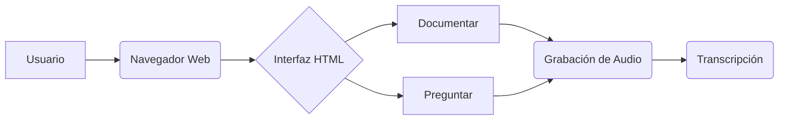

### 1. 📄 Descripción general del proyecto
- **Nombre del código:** Reconocimiento de Voz
- **Versión:** 1.0
- **Explicación general:** Este código HTML define la interfaz de usuario para una aplicación web de reconocimiento de voz con dos funcionalidades principales: "Documentar" y "Preguntar". Permite a los usuarios grabar audio y transcribirlo para documentar código o hacer preguntas.
- **Qué problema resuelve el código:** Facilita la documentación de código y la interacción mediante voz, ofreciendo una alternativa a la entrada manual de texto.

### 2. ⚙️ Visión general del sistema
- **Arquitectura del sistema:**

- **Tecnologías utilizadas:**
  - HTML
  - CSS
  - JavaScript
- **Dependencias:**
  - Google Fonts (Nunito)
  - aws-sdk.min.js
  - my_script.js
  - placeholder-handler.js
- **Requisitos del sistema:**
  - Navegador web compatible con HTML5 y JavaScript.
  - Conexión a Internet (para cargar Google Fonts y los scripts externos).
  - Micrófono (para la grabación de audio).
- **Prerrequisitos:**
  - Tener los archivos JavaScript (aws-sdk.min.js, my_script.js, placeholder-handler.js) disponibles en la misma ubicación o en una ubicación accesible.

### 3. 📦 Guía de uso
- **Cómo usarlo:**
  1. Abrir el archivo HTML en un navegador web.
  2. Utilizar la sección "Documentar" para grabar audio relacionado con la documentación del código.
  3. Utilizar la sección "Preguntar" para grabar audio con preguntas.
  4. Opcionalmente, pegar código en el área de texto provista para su documentación.
- **Explicación de los pasos (entrada, salida, parámetros):**
  - **Entrada:**
    - Interacción del usuario a través de los botones "Start Recording" y "Stop Recording" en las secciones "Documentar" y "Preguntar".
    - Entrada de texto opcional a través del área de texto para pegar código.
  - **Salida:**
    - Transcripción del audio grabado (el código no muestra dónde se visualiza, pero se asume que `my_script.js` maneja la transcripción y la muestra en la interfaz).
  - **Parámetros:**
    - No hay parámetros explícitos en el código HTML. Los parámetros para la grabación y transcripción de audio se manejan en los archivos JavaScript (aws-sdk.min.js y my_script.js).
- **Caso de uso de ejemplo:**
```html
<!DOCTYPE html>
<html>
<head>
    <title>Ejemplo Mínimo de Reconocimiento de Voz</title>
</head>
<body>
    <button id="recordButton">Grabar</button>
    <p id="transcription">Aquí aparecerá la transcripción.</p>

    <script>
        document.getElementById('recordButton').addEventListener('click', function() {
            document.getElementById('transcription').textContent = "Grabando... (simulado)";
            // En una implementación real, aquí iría el código para iniciar la grabación y la transcripción.
            // Este ejemplo solo simula el proceso.
            setTimeout(function() {
                document.getElementById('transcription').textContent = "Transcripción simulada: Hola, este es un ejemplo.";
            }, 3000); // Simula una grabación de 3 segundos.
        });
    </script>
</body>
</html>
```

### 5. 📚 Referencias
- Documentación de la API de AWS SDK para JavaScript: [https://aws.amazon.com/sdk-for-javascript/](https://aws.amazon.com/sdk-for-javascript/)
- Web Speech API: [https://developer.mozilla.org/en-US/docs/Web/API/Web_Speech_API](https://developer.mozilla.org/en-US/docs/Web/API/Web_Speech_API)
- Google Fonts: [https://fonts.google.com/](https://fonts.google.com/)
