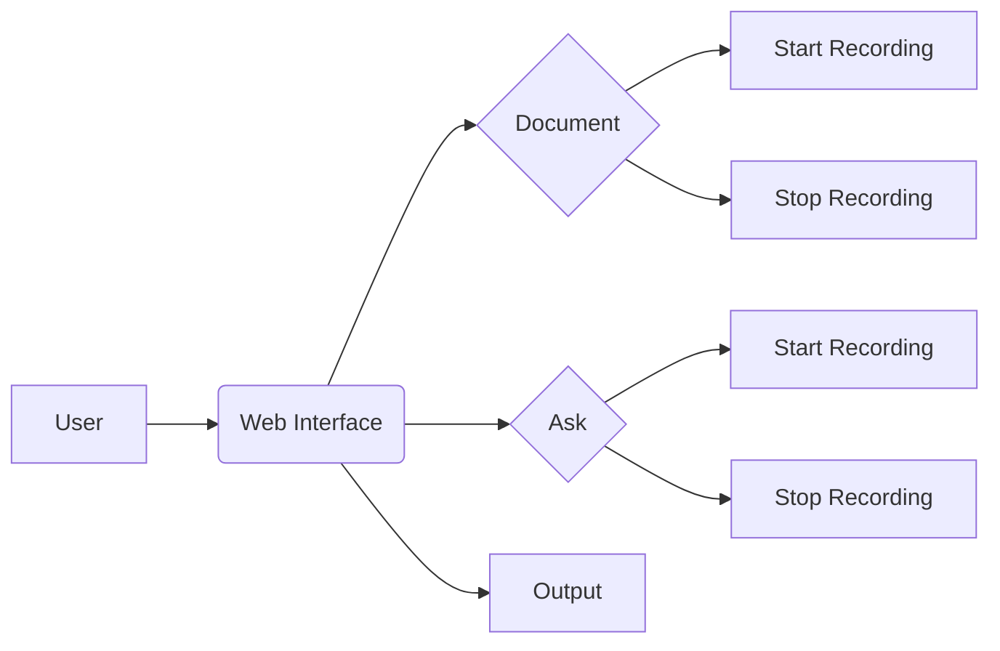

📄 Descripción general del proyecto
Nombre del código: Reconocimiento de Voz
Versión: 1.0
Explicación general: Interfaz web para la documentación y consulta mediante reconocimiento de voz. Permite grabar audio para documentar código o realizar preguntas.
Qué problema resuelve el código: Facilita la documentación de código y la interacción mediante voz, ofreciendo una alternativa a la entrada manual.

⚙️ Visión general del sistema
Arquitectura del sistema:

Tecnologías utilizadas: HTML, CSS, JavaScript
Dependencias:
  - Google Fonts (Nunito)
  - aws-sdk.min.js
  - my_script.js
  - placeholder-handler.js
Requisitos del sistema:
  - Navegador web compatible con HTML5 y JavaScript
Prerrequisitos:
  - Conexión a Internet para cargar fuentes y scripts externos

📦 Guía de uso
Cómo usarlo:
  - Entrada: El usuario interactúa con la interfaz web a través de botones y un área de texto editable.
  - Salida: La transcripción del audio se muestra en el elemento con el id "output".
  - Parámetros: No aplica, la interacción se realiza a través de la interfaz gráfica.
Explicación de los pasos:
  1. El usuario accede a la página web.
  2. El usuario puede pegar código en el área de texto provista.
  3. El usuario puede iniciar la grabación de voz para documentar o preguntar.
  4. El usuario detiene la grabación.
  5. El texto transcrito se muestra en el área de salida.
Caso de uso de ejemplo:
```html
<!DOCTYPE html>
<html>
<head>
    <title>Ejemplo de Reconocimiento de Voz</title>
</head>
<body>
    <button id="startButton">Iniciar Grabación</button>
    <p id="output">Presiona el botón para iniciar.</p>
    <script>
        document.getElementById('startButton').addEventListener('click', function() {
            document.getElementById('output').textContent = 'Grabando...';
            // Aquí iría el código para iniciar la grabación de voz
            // y actualizar el elemento 'output' con la transcripción.
        });
    </script>
</body>
</html>
```
