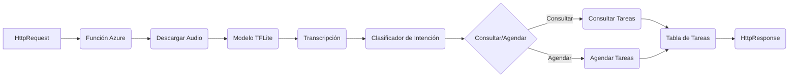

## 📄 Descripción general del proyecto

**Nombre del código:** Brain Function App

**Versión:** 1.0

**Explicación general:**

Este código implementa una función de Azure que procesa audio, lo transcribe a texto y luego utiliza ese texto para consultar o agendar tareas. Utiliza un modelo de transcripción de voz a texto (STT) basado en TensorFlow Lite y un clasificador de texto para determinar la intención del usuario (consultar o agendar).

**Qué problema resuelve el código:**

El código resuelve el problema de automatizar la gestión de tareas a través de la voz. Permite a los usuarios interactuar con el sistema utilizando comandos de voz, que luego se transcriben y se utilizan para consultar tareas existentes o agendar nuevas tareas.

## ⚙️ Visión general del sistema

**Arquitectura del sistema:**



**Tecnologías utilizadas:**

*   Azure Functions
*   TensorFlow Lite
*   Transformers (pipeline)
*   pandas
*   NumPy
*   soundfile
*   azure-storage-blob
*   ds\_ctcdecoder

**Dependencias:**

*   azure-functions
*   pandas
*   numpy
*   soundfile
*   tflite-runtime
*   ds\_ctcdecoder
*   transformers
*   azure-storage-blob

**Requisitos del sistema:**

*   Cuenta de Azure con acceso a Azure Functions y Azure Blob Storage.
*   Entorno de Python 3.6 o superior.
*   Las dependencias listadas deben estar instaladas.

**Prerrequisitos:**

*   Modelo de TensorFlow Lite (`model_quantized_Revision.tflite`) entrenado para la transcripción de voz a texto.
*   Archivo de alfabeto (`alphabet_ES.json`) que mapea los símbolos del modelo a caracteres.
*   Archivo de alfabeto para el decodificador DeepSpeech (`alphabet_ES.txt`).
*   Archivo de scorer KenLM (`kenlm_es_n12.scorer`) para mejorar la precisión de la transcripción.
*   Archivo CSV (`Tabla_Tareas.csv`) almacenado en Azure Blob Storage.

## 📦 Guía de uso

**Cómo usarlo:**

La función se activa mediante una solicitud HTTP.  El audio a transcribir debe estar previamente almacenado en Azure Blob Storage. La función descarga el audio, lo transcribe y, basándose en el texto transcrito, consulta o agenda una tarea.

**Explicación de los pasos:**

1.  **Entrada:** Solicitud HTTP con un parámetro `name` (opcional, no usado directamente en el flujo principal). El archivo de audio `output.wav` debe estar presente en el contenedor "raw" en Azure Blob Storage.
2.  **Descarga del audio:** La función descarga el archivo de audio `output.wav` desde Azure Blob Storage al directorio `./HttpBrain/`.
3.  **Transcripción:** El audio descargado se transcribe a texto utilizando el modelo de TensorFlow Lite y el decodificador DeepSpeech.
4.  **Clasificación de la intención:** El texto transcrito se clasifica utilizando un modelo de Transformers para determinar si la intención del usuario es "consultar" o "agendar".
5.  **Consulta o Agendamiento:**
    *   Si la intención es "consultar", la función busca tareas en el archivo `Tabla_Tareas.csv` que coincidan con la fecha especificada en el texto transcrito y devuelve una lista de tareas.
    *   Si la intención es "agendar", la función extrae la fecha y la tarea del texto transcrito y agrega una nueva entrada al archivo `Tabla_Tareas.csv` en Azure Blob Storage.
6.  **Salida:** La función devuelve una respuesta HTTP que contiene la lista de tareas encontradas (en caso de consulta) o un mensaje de éxito (en caso de agendamiento).

**Caso de uso de ejemplo:**

```python
import requests
import json

# URL de la función de Azure
url = "YOUR_AZURE_FUNCTION_URL"

# Datos para la solicitud (si es necesario, aunque el audio se espera en Blob Storage)
data = {"name": "test"}

# Enviar la solicitud POST
response = requests.post(url, data=json.dumps(data))

# Imprimir la respuesta
print(response.status_code)
print(response.text)
```

Este ejemplo asume que ya existe un archivo de audio llamado `output.wav` en el contenedor "raw" de Azure Blob Storage. La función procesará este audio y devolverá la respuesta correspondiente.

## 🔐 Documentación de la API

Esta sección no aplica ya que el código proporcionado no define una API explícita con endpoints, formatos de solicitud/respuesta y autenticación/autorización. Se trata de una función de Azure que se activa mediante HTTP, pero la lógica principal se centra en el procesamiento interno de audio y texto.

## 📚 Referencias

*   **Azure Functions:** [https://docs.microsoft.com/en-us/azure/azure-functions/](https://docs.microsoft.com/en-us/azure/azure-functions/)
*   **Azure Blob Storage:** [https://docs.microsoft.com/en-us/azure/storage/blobs/storage-blobs-introduction](https://docs.microsoft.com/en-us/azure/storage/blobs/storage-blobs-introduction)
*   **TensorFlow Lite:** [https://www.tensorflow.org/lite](https://www.tensorflow.org/lite)
*   **Transformers (Hugging Face):** [https://huggingface.co/transformers/](https://huggingface.co/transformers/)
*   **DeepSpeech:** [https://github.com/mozilla/DeepSpeech](https://github.com/mozilla/DeepSpeech)
*   **KenLM:** [https://github.com/kpu/kenlm](https://github.com/kpu/kenlm)
