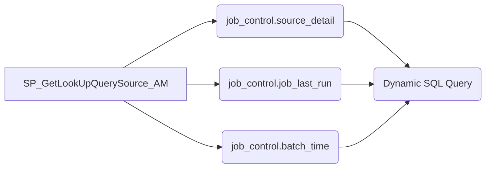

## 📄 Descripción general del proyecto

-   **Nombre del código:** `SP_GetLookUpQuerySource_AM`
-   **Versión:** N/A
-   **Explicación general:** Este stored procedure genera dinámicamente una consulta SQL para extraer datos de una tabla de origen, basándose en metadatos almacenados en la tabla `job_control.source_detail`. La consulta generada considera varios factores, como la presencia de una columna delta para la carga incremental, una cláusula WHERE adicional, un override de consulta y la necesidad de manejar el tiempo de extracción.
-   **Qué problema resuelve el código:** El código resuelve el problema de generar dinámicamente consultas de extracción de datos basadas en la configuración almacenada en una tabla de metadatos, lo que permite una mayor flexibilidad y mantenibilidad en los procesos de ETL.

## ⚙️ Visión general del sistema

-   **Arquitectura del sistema:**



-   **Tecnologías utilizadas:**
    -   SQL
-   **Dependencias:**
    -   Tablas `job_control.source_detail`, `job_control.job_last_run` y `job_control.batch_time`.
-   **Requisitos del sistema:**
    -   SQL Server o Azure Synapse Analytics (SQL Pool).
-   **Prerrequisitos:**
    -   Las tablas `job_control.source_detail`, `job_control.job_last_run` y `job_control.batch_time` deben existir y estar pobladas con los metadatos necesarios.
    -   El usuario que ejecuta el stored procedure debe tener permisos de lectura sobre las tablas mencionadas.

## 📦 Guía de uso

-   **Cómo usarlo:** El stored procedure se ejecuta en SQL Server o Azure Synapse Analytics (SQL Pool) y requiere varios parámetros de entrada para filtrar los metadatos y generar la consulta SQL correcta.
-   **Explicación de los pasos:**
    1.  **Parámetros de entrada:** El procedimiento recibe varios parámetros de entrada, incluyendo el nombre de la fuente, el tipo de formato de la fuente, el área de negocio, la frecuencia, flags para indicar si el landing y el bronze están procesados, y la zona.
    2.  **Consulta a las tablas de metadatos:** El procedimiento consulta las tablas `job_control.source_detail`, `job_control.job_last_run` y `job_control.batch_time` para obtener los metadatos necesarios para generar la consulta SQL.
    3.  **Generación dinámica de la consulta SQL:** El procedimiento genera dinámicamente la consulta SQL basándose en los metadatos obtenidos y los parámetros de entrada. La consulta generada puede incluir una cláusula WHERE para la carga incremental, una cláusula WHERE adicional, un override de consulta y el manejo del tiempo de extracción.
    4.  **Retorno de la consulta SQL:** El procedimiento retorna la consulta SQL generada como una columna llamada `sourceQuery`.

-   **Caso de uso de ejemplo:**

```sql
-- Ejemplo de uso del stored procedure
DECLARE @Source_Name VARCHAR(100) = 'Tucan';
DECLARE @source_format_type VARCHAR(100) = 'Parquet';
DECLARE @business_area VARCHAR(100) = 'Finance';
DECLARE @Frequency VARCHAR(1) = 'D';
DECLARE @landing_flg INT = 1;
DECLARE @bronze_flg INT = 1;
DECLARE @zone VARCHAR(20) = 'America';

EXEC [job_control].[SP_GetLookUpQuerySource_AM]
    @Source_Name = @Source_Name,
    @source_format_type = @source_format_type,
    @business_area = @business_area,
    @Frequency = @Frequency,
    @landing_flg = @landing_flg,
    @bronze_flg = @bronze_flg,
    @zone = @zone;
```

## 🔐 Documentación de la API

-   **Endpoints:** Este stored procedure no expone un endpoint HTTP directamente. Se ejecuta dentro del contexto de SQL Server o Azure Synapse Analytics (SQL Pool).
-   **Formatos de solicitud y respuesta:**
    -   **Solicitud:** La solicitud se realiza mediante la ejecución del stored procedure con los parámetros de entrada especificados.
    -   **Respuesta:** El stored procedure retorna un conjunto de resultados con una columna llamada `sourceQuery` que contiene la consulta SQL generada dinámicamente.
-   **Autenticación y autorización:** La autenticación y autorización se gestionan a nivel de SQL Server o Azure Synapse Analytics (SQL Pool). El usuario que ejecuta el stored procedure debe tener los permisos necesarios para leer las tablas `job_control.source_detail`, `job_control.job_last_run` y `job_control.batch_time`.

## 📚 Referencias

-   **Dynamic SQL:** [https://learn.microsoft.com/en-us/sql/relational-databases/system-stored-procedures/sp-executesql-transact-sql?view=sql-server-ver16](https://learn.microsoft.com/en-us/sql/relational-databases/system-stored-procedures/sp-executesql-transact-sql?view=sql-server-ver16)
-   **QUOTENAME:** [https://learn.microsoft.com/en-us/sql/t-sql/functions/quotename-transact-sql?view=sql-server-ver16](https://learn.microsoft.com/en-us/sql/t-sql/functions/quotename-transact-sql?view=sql-server-ver16)
