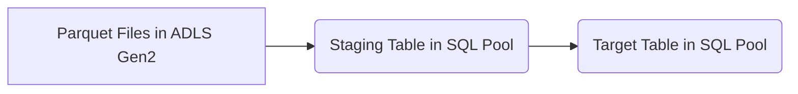

## 📄 Descripción general del proyecto

-   **Nombre del código:** `sp_incremental_charge`
-   **Versión:** N/A
-   **Explicación general:** Este stored procedure realiza una carga incremental de datos desde archivos Parquet almacenados en Azure Data Lake Storage Gen2 (ADLS Gen2) a una tabla en Azure Synapse Analytics (SQL Pool). El procedimiento está diseñado para cargar datos de forma incremental, eliminando primero los datos existentes para un rango de fechas específico antes de insertar los nuevos datos.
-   **Qué problema resuelve el código:** El código resuelve el problema de cargar datos de forma incremental en un data warehouse, asegurando que los datos más recientes estén disponibles y evitando la duplicación de datos.

## ⚙️ Visión general del sistema

-   **Arquitectura del sistema:**



-   **Tecnologías utilizadas:**
    -   SQL
    -   Azure Data Lake Storage Gen2 (ADLS Gen2)
    -   Azure Synapse Analytics (SQL Pool)
    -   Parquet file format
-   **Dependencias:**
    -   Acceso a Azure Data Lake Storage Gen2.
    -   Acceso a Azure Synapse Analytics (SQL Pool).
-   **Requisitos del sistema:**
    -   Azure Synapse Analytics (SQL Pool)
    -   Azure Data Lake Storage Gen2
-   **Prerrequisitos:**
    -   Credenciales de acceso a ADLS Gen2 configuradas con Managed Identity.
    -   Permisos para crear y eliminar tablas en el esquema `mex_stg`.
    -   Permisos para insertar y eliminar datos en la tabla destino.

## 📦 Guía de uso

-   **Cómo usarlo:** El stored procedure se ejecuta en Azure Synapse Analytics (SQL Pool) y requiere un parámetro JSON (`@PARAMS`) que contiene la configuración necesaria para la carga de datos.
-   **Explicación de los pasos:**
    1.  **Parámetros JSON:** El procedimiento recibe un string JSON con los parámetros de configuración.
    2.  **Obtener parámetros del JSON:** Extrae los valores de los parámetros del string JSON.
    3.  **Verificar si la tabla STG existe:** Verifica si la tabla temporal (staging) existe y la elimina si es necesario.
    4.  **Establecer la fecha:** Si la fecha está vacía, se establece la fecha actual.
    5.  **Creación de la tabla STG:** Crea una tabla temporal (staging) y copia los datos desde los archivos Parquet en ADLS Gen2.
    6.  **Agregar columna business\_date:** Agrega una columna `business_date` a la tabla temporal y la actualiza con el valor proporcionado.
    7.  **Eliminar los últimos días en la tabla SQL Pool:** Elimina los datos existentes en la tabla destino para el rango de fechas especificado.
    8.  **Establecer fecha mínima y máxima de la fecha de proceso:** Establece la fecha mínima y máxima de la fecha de proceso.
    9.  **Consulta de eliminación con fecha mínima y máxima como período a eliminar:** Elimina los datos existentes en la tabla destino para el rango de fechas especificado.
    10. **Eliminar tabla STG:** Elimina la tabla temporal (staging).
    11. **Insertar datos de la fecha de proceso a la tabla principal:** Inserta los datos desde la tabla temporal a la tabla destino.

-   **Caso de uso de ejemplo:**

```sql
-- Ejemplo de uso del stored procedure
DECLARE @json_params VARCHAR(1000);
SET @json_params = '{"country_code": "mex", "schema_suffix": "dwh","account_name":"azusst1voo929","source_name":"tucan","table_name":"tarjetas","fecha":"20230606","business_date":"fecha_creacion", "is_finance": 0}';

EXEC [mex_dwh].[sp_incremental_charge] @PARAMS = @json_params;
```

## 🔐 Documentación de la API

-   **Endpoints:** Este stored procedure no expone un endpoint HTTP directamente. Se ejecuta dentro del contexto de Azure Synapse Analytics (SQL Pool).
-   **Formatos de solicitud y respuesta:**
    -   **Solicitud:** La solicitud se realiza mediante la ejecución del stored procedure con un parámetro `@PARAMS` de tipo VARCHAR(1000) que contiene un string JSON.
    -   **Respuesta:** El stored procedure no devuelve un valor directamente. El resultado se refleja en la tabla de destino en Azure Synapse Analytics (SQL Pool).
-   **Autenticación y autorización:** La autenticación y autorización se gestionan a nivel de Azure Synapse Analytics (SQL Pool). El usuario que ejecuta el stored procedure debe tener los permisos necesarios para acceder a ADLS Gen2 (a través de Managed Identity) y para leer, escribir y eliminar datos en las tablas de SQL Pool.

## 📚 Referencias

-   **Azure Data Lake Storage Gen2:** [https://docs.microsoft.com/en-us/azure/storage/blobs/data-lake-storage-introduction](https://docs.microsoft.com/en-us/azure/storage/blobs/data-lake-storage-introduction)
-   **Azure Synapse Analytics:** [https://docs.microsoft.com/en-us/azure/synapse-analytics/](https://docs.microsoft.com/en-us/azure/synapse-analytics/)
-   **COPY statement:** [https://learn.microsoft.com/en-us/sql/t-sql/statements/copy-into-transact-sql?view=azure-sqldw-latest](https://learn.microsoft.com/en-us/sql/t-sql/statements/copy-into-transact-sql?view=azure-sqldw-latest)
-   **OPENJSON:** [https://docs.microsoft.com/en-us/sql/t-sql/functions/openjson-transact-sql?view=sql-server-ver16](https://docs.microsoft.com/en-us/sql/t-sql/functions/openjson-transact-sql?view=sql-server-ver16)
