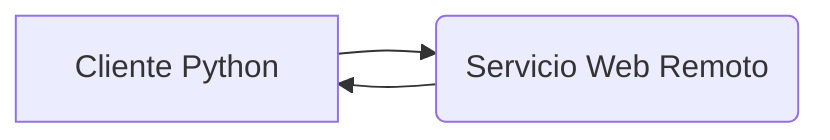

## 📄 Descripción general del proyecto

*   **Nombre del código:** Cliente HTTP para servicio remoto
*   **Versión:** 1.0
*   **Explicación general:** Este script de Python realiza una solicitud GET a un servicio web remoto utilizando la biblioteca `requests`. Envía un parámetro llamado "name" con el valor "Juan" y muestra la respuesta del servidor en la consola.
*   **Qué problema resuelve el código:** Facilita la interacción con un servicio web, permitiendo enviar datos y recibir respuestas para su procesamiento.

## ⚙️ Visión general del sistema



*   **Tecnologías utilizadas:** Python, requests
*   **Dependencias:** requests
*   **Requisitos del sistema:** Python 3.6 o superior, biblioteca `requests` instalada.
*   **Prerrequisitos:** Conexión de red al servicio web remoto.

## 📦 Guía de uso

*   **Cómo usarlo:** Ejecutar el script de Python.
*   **Explicación de los pasos:**
    1.  Se define la URL del servicio web remoto.
    2.  Se define un diccionario con los parámetros a enviar en la solicitud GET.
    3.  Se utiliza la función `requests.get()` para enviar la solicitud al servicio web, incluyendo los parámetros.
    4.  Se imprime el contenido de la respuesta recibida del servidor.
*   **Caso de uso de ejemplo:**

```python
import requests

# Simula un servicio que requiere un ID de usuario
def obtener_datos_usuario(user_id):
    url = "https://ejemplo.com/api/usuarios"  # Reemplazar con la URL real
    params = {"id": user_id}
    try:
        response = requests.get(url, params=params)
        response.raise_for_status()  # Lanza una excepción para códigos de error HTTP
        data = response.json()
        return data
    except requests.exceptions.RequestException as e:
        print(f"Error al obtener datos del usuario: {e}")
        return None

# Ejemplo de uso
id_usuario = 123
datos_usuario = obtener_datos_usuario(id_usuario)

if datos_usuario:
    print(f"Datos del usuario {id_usuario}: {datos_usuario}")
```

## 🔐 Documentación de la API

*   **Endpoints:** `https://callgemini-397605286686.us-central1.run.app`
*   **Formatos de solicitud y respuesta:**
    *   Solicitud: GET con parámetro `name` en la URL.
    *   Respuesta: Texto plano.
*   **Autenticación y autorización:** No especificado.

## 📚 Referencias

*   [requests library](https://requests.readthedocs.io/en/latest/): Documentación de la biblioteca `requests` de Python.
*   [HTTP GET](https://developer.mozilla.org/en-US/docs/Web/HTTP/Methods/GET): Información sobre el método HTTP GET.
