## 📄 Descripción general del proyecto

-   **Nombre del código:** `sp_incremental_charge`
-   **Versión:** N/A
-   **Explicación general:** Este stored procedure realiza una carga incremental de datos desde un datalake (Azure Data Lake Storage) a una tabla en un Synapse SQL Pool. El proceso incluye la creación de una tabla temporal (staging), la carga de datos desde el datalake a esta tabla temporal, la eliminación de datos existentes en la tabla de destino correspondientes al rango de fechas del nuevo lote, y finalmente, la inserción de los datos desde la tabla temporal a la tabla de destino.
-   **Qué problema resuelve el código:** Facilita la actualización de tablas en un data warehouse con datos nuevos o modificados, minimizando el impacto en el rendimiento y asegurando la integridad de los datos. Permite la ingesta de datos desde ficheros Parquet almacenados en Azure Data Lake Storage, realizando la carga de forma incremental basada en una fecha de negocio especificada.

## ⚙️ Visión general del sistema

```mermaid
graph LR
    A[Parámetros JSON] --> B(Extracción de Parámetros);
    B --> C{Existe tabla STG?};
    C -- Sí --> D[Eliminar tabla STG];
    C -- No --> E[Crear tabla STG];
    D --> E;
    E --> F[Copiar datos desde ADLS a STG];
    F --> G[Añadir columna business_date a STG];
    G --> H[Actualizar business_date en STG];
    H --> I[Obtener min/max business_date de STG];
    I --> J[Eliminar datos en tabla principal];
    J --> K[Copiar datos desde ADLS a tabla principal];
    K --> L[Eliminar tabla STG];
```



-   **Tecnologías utilizadas:**
    -   SQL Server Stored Procedure
    -   Azure Synapse Analytics (SQL Pool)
    -   Azure Data Lake Storage (ADLS)
    -   `OPENJSON`
    -   `COPY INTO`
-   **Dependencias:**
    -   Acceso a Azure Data Lake Storage.
    -   Permisos para crear y eliminar tablas en el esquema `chl_stg`.
    -   Permisos para eliminar e insertar datos en la tabla de destino.
-   **Requisitos del sistema:**
    -   Azure Synapse Analytics (SQL Pool)
    -   Azure Data Lake Storage Gen2
-   **Prerrequisitos:**
    -   Configuración de una Managed Identity con permisos de acceso al Azure Data Lake Storage.
    -   Existencia de la estructura de directorios en ADLS: `https://azusst1voo929.dfs.core.windows.net/datalake/chl/datalake.db/{source_name}_{table_name}/processdate={fecha}/*/*.parquet`
    -   La tabla de destino debe existir o la opción `AUTO_CREATE_TABLE = 'ON'` debe funcionar correctamente.

## 📦 Guía de uso

-   **Cómo usarlo:** El stored procedure se ejecuta mediante la instrucción `EXEC` en SQL Server, pasando un string JSON como parámetro. Este JSON contiene la información necesaria para la carga incremental, como el código de país, el esquema, el nombre de la cuenta, el origen de los datos, el nombre de la tabla, la fecha de proceso y la columna que representa la fecha de negocio.
-   **Explicación de los pasos (entrada, salida, parámetros):**
    -   **Entrada:** Un string JSON con la configuración de la carga incremental.
    -   **Salida:** La tabla de destino actualizada con los nuevos datos.
    -   **Parámetros:**
        -   `@PARAMS`: Un string JSON que contiene los siguientes campos:
            -   `country_code`: Código del país (VARCHAR(3)).
            -   `schema_suffix`: Sufijo del esquema (VARCHAR(10)).
            -   `account_name`: Nombre de la cuenta de almacenamiento (VARCHAR(64)).
            -   `source_name`: Nombre del origen de datos (VARCHAR(10)).
            -   `table_name`: Nombre de la tabla (VARCHAR(80)).
            -   `fecha`: Fecha de proceso (formato YYYYMMDD) (VARCHAR(8)).
            -   `business_date`: Nombre de la columna que representa la fecha de negocio (VARCHAR(100)).
-   **Caso de uso de ejemplo:**

```sql
-- Ejemplo de uso del stored procedure
DECLARE @json_params VARCHAR(1000);
SET @json_params = '{"country_code": "chl", "schema_suffix": "dwh","account_name":"azusst1voo929","source_name":"tucan","table_name":"tarjetas","fecha":"20230606","business_date":"fecha_creacion"}';      

EXEC chl_dwh.sp_incremental_charge @PARAMS = @json_params;
```

## 🔐 Documentación de la API

N/A - Este código es un stored procedure, no una API.

## 📚 Referencias

-   **OPENJSON (Transact-SQL):** [https://learn.microsoft.com/en-us/sql/t-sql/functions/openjson-transact-sql?view=sql-server-ver16](https://learn.microsoft.com/en-us/sql/t-sql/functions/openjson-transact-sql?view=sql-server-ver16)
-   **COPY INTO (Transact-SQL):** [https://learn.microsoft.com/en-us/sql/t-sql/statements/copy-into-transact-sql?view=azure-sqldw-latest](https://learn.microsoft.com/en-us/sql/t-sql/statements/copy-into-transact-sql?view=azure-sqldw-latest)
-   **Azure Data Lake Storage Gen2:** [https://learn.microsoft.com/en-us/azure/storage/blobs/data-lake-storage-introduction](https://learn.microsoft.com/en-us/azure/storage/blobs/data-lake-storage-introduction)
-   **Managed Identities for Azure Resources:** [https://learn.microsoft.com/en-us/azure/active-directory/managed-identities-azure-resources/overview](https://learn.microsoft.com/en-us/azure/active-directory/managed-identities-azure-resources/overview)
