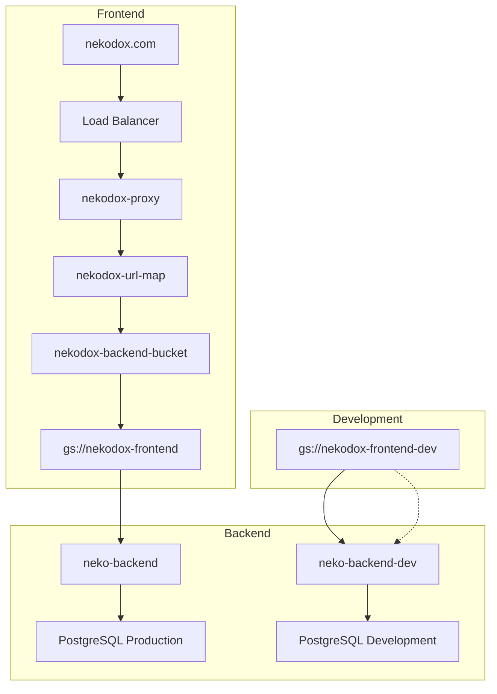

# 🚀 Arquitectura de Despliegue - NekoDox

## 📋 Resumen

Este documento explica la arquitectura de despliegue de NekoDox, qué modifica cada script y cómo funciona el sistema de Load Balancer.

## 🏗️ Arquitectura General



## 📁 Estructura de Servicios

### **Frontend Buckets**
- **`gs://nekodox-frontend`** → Producción (servido por nekodox.com)
- **`gs://nekodox-frontend-dev`** → Desarrollo (acceso directo)

### **Backend Services**
- **`neko-backend`** → Producción (2Gi RAM, 2 CPU)
- **`neko-backend-dev`** → Desarrollo (1Gi RAM, 1 CPU)

### **Load Balancer Chain**
- **`nekodox.com`** → IP: `34.111.226.178`
- **`nekodox-forwarding-rule`** → `nekodox-proxy`
- **`nekodox-proxy`** → `nekodox-url-map`
- **`nekodox-url-map`** → `nekodox-backend-bucket`
- **`nekodox-backend-bucket`** → `gs://nekodox-frontend`

## 🛠️ Scripts de Despliegue

### **Backend Scripts**

#### `deploy_cloudrun.py` - Backend de Producción
```bash
python deploy_cloudrun.py
```

**¿Qué modifica?**
- ✅ Despliega el backend a `neko-backend` (Cloud Run)
- ✅ Configura variables de entorno de producción
- ✅ **NO modifica** el Load Balancer
- ✅ **NO modifica** el frontend

**Resultado:**
- Backend disponible en: `https://neko-backend-uxtxxsgt4a-uc.a.run.app`

#### `deploy_cloudrun_dev.py` - Backend de Desarrollo
```bash
python deploy_cloudrun_dev.py
```

**¿Qué modifica?**
- ✅ Despliega el backend a `neko-backend-dev` (Cloud Run)
- ✅ Configura variables de entorno de desarrollo
- ✅ **NO modifica** el Load Balancer
- ✅ **NO modifica** el frontend

**Resultado:**
- Backend disponible en: `https://neko-backend-dev-[hash]-uc.a.run.app`

### **Frontend Scripts**

#### `deploy_frontend.py` - Frontend de Producción
```bash
python deploy_frontend.py
```

**¿Qué modifica?**
- ✅ Construye el frontend (`npm run build`)
- ✅ Sube archivos a `gs://nekodox-frontend`
- ✅ **NO modifica** el Load Balancer
- ✅ **SÍ afecta** `nekodox.com` (porque el Load Balancer sirve este bucket)

**Resultado:**
- Frontend disponible en: `https://storage.googleapis.com/nekodox-frontend`
- **nekodox.com se actualiza automáticamente**

#### `deploy_frontend_dev.py` - Frontend de Desarrollo
```bash
python deploy_frontend_dev.py
```

**¿Qué modifica?**
- ✅ Construye el frontend (`npm run build`)
- ✅ Sube archivos a `gs://nekodox-frontend-dev`
- ✅ **NO modifica** el Load Balancer
- ✅ **NO afecta** `nekodox.com`

**Resultado:**
- Frontend disponible en: `https://storage.googleapis.com/nekodox-frontend-dev`

### **Configuración Scripts**

#### `update_frontend_prod_config.py` - Configurar Frontend para Producción
```bash
python update_frontend_prod_config.py
```

**¿Qué modifica?**
- ✅ Cambia URLs en `code-compass-ui/src/pages/Index.tsx`
- ✅ Reemplaza URLs de desarrollo por URLs de producción
- ✅ Crea backup del archivo original
- ✅ **NO modifica** el Load Balancer

**Resultado:**
- Código del frontend apunta a backend de producción

#### `update_frontend_dev_config.py` - Configurar Frontend para Desarrollo
```bash
python update_frontend_dev_config.py
```

**¿Qué modifica?**
- ✅ Cambia URLs en `code-compass-ui/src/pages/Index.tsx`
- ✅ Reemplaza URLs de producción por URLs de desarrollo
- ✅ Crea backup del archivo original
- ✅ **NO modifica** el Load Balancer

**Resultado:**
- Código del frontend apunta a backend de desarrollo

## 🔄 Flujos de Trabajo

### **Desarrollo de Nuevas Características**
```bash
# 1. Configurar frontend para desarrollo
python update_frontend_dev_config.py

# 2. Desplegar backend de desarrollo
python deploy_cloudrun_dev.py

# 3. Desplegar frontend de desarrollo
python deploy_frontend_dev.py

# 4. Probar en: https://storage.googleapis.com/nekodox-frontend-dev
```

### **Despliegue a Producción**
```bash
# 1. Asegurar que el código apunta a producción
# (Verificar que Index.tsx tenga URLs de producción)

# 2. Desplegar backend de producción
python deploy_cloudrun.py

# 3. Desplegar frontend de producción
python deploy_frontend.py

# 4. Verificar en: nekodox.com (limpiar caché del navegador)
```

## ⚠️ Puntos Importantes

### **Load Balancer**
- **NUNCA se modifica** automáticamente
- **Siempre apunta** a `gs://nekodox-frontend`
- **Solo sirve** el contenido más reciente del bucket

### **Caché del Navegador**
- **Después de cada despliegue** limpiar caché (Ctrl+F5)
- **O usar ventana de incógnito** para verificar cambios
- **Esperar 1-2 minutos** para propagación

### **Variables de Entorno**
- **Backend de producción**: `neko-backend` (Cloud Run)
- **Backend de desarrollo**: `neko-backend-dev` (Cloud Run)
- **Cada uno tiene** sus propias variables de entorno

## 🎯 Resumen de Impacto

| Script | Backend | Frontend | Load Balancer | nekodox.com |
|--------|---------|----------|---------------|-------------|
| `deploy_cloudrun.py` | ✅ Modifica | ❌ No toca | ❌ No toca | ❌ No afecta |
| `deploy_cloudrun_dev.py` | ✅ Modifica | ❌ No toca | ❌ No toca | ❌ No afecta |
| `deploy_frontend.py` | ❌ No toca | ✅ Modifica | ❌ No toca | ✅ Afecta |
| `deploy_frontend_dev.py` | ❌ No toca | ✅ Modifica | ❌ No toca | ❌ No afecta |
| `update_frontend_prod_config.py` | ❌ No toca | ✅ Modifica | ❌ No toca | ❌ No afecta |
| `update_frontend_dev_config.py` | ❌ No toca | ✅ Modifica | ❌ No toca | ❌ No afecta |

## 🚨 Troubleshooting

### **Problema: nekodox.com no se actualiza**
**Solución:**
1. Verificar que `deploy_frontend.py` se ejecutó correctamente
2. Limpiar caché del navegador (Ctrl+F5)
3. Esperar 1-2 minutos para propagación

### **Problema: Frontend apunta a backend incorrecto**
**Solución:**
1. Verificar URLs en `code-compass-ui/src/pages/Index.tsx`
2. Ejecutar script de configuración correspondiente
3. Redesplegar frontend

### **Problema: Backend no responde**
**Solución:**
1. Verificar logs del Cloud Run correspondiente
2. Verificar variables de entorno
3. Redesplegar backend

---

**Fecha de Creación:** 6 de Septiembre, 2025  
**Versión:** 1.0  
**Estado:** ✅ Documentación Completa
